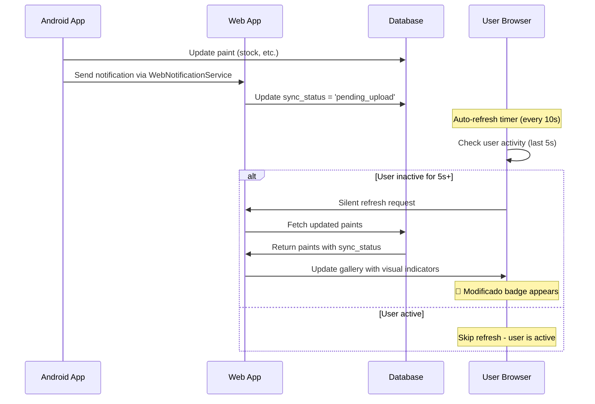

# Auto-Refresh System Optimization - 2025-07-19

## 📋 Resumen Ejecutivo

**Problema**: El sistema de auto-refresh estaba constantemente pausado debido a una detección de actividad del usuario demasiado sensible, impidiendo la actualización automática de la galería cuando Android enviaba notificaciones.

**Solución**: Optimización de los parámetros de detección de actividad y frecuencia de actualización para permitir updates automáticos sin interferir con la experiencia del usuario.

## 🔧 Cambios Técnicos Implementados

### 1. Optimización de Parámetros de Refresh

**Archivo**: `/templates/admin/paints.html`  
**Líneas**: 1208-1232

#### Cambios Realizados:

```javascript
// ANTES (problemático)
let refreshInterval = 60000; // 60 segundos
const timeSinceActivity = Date.now() - lastUserActivity;
if (timeSinceActivity > 30000) { // 30 segundos sin actividad
    // refresh...
}

// DESPUÉS (optimizado)
let refreshInterval = 10000; // 10 segundos para detectar cambios de Android rápidamente
const timeSinceActivity = Date.now() - lastUserActivity;
if (timeSinceActivity > 5000) { // 5 segundos sin actividad (reducido de 30)
    // refresh...
}
```

### 2. Reducción de Sensibilidad en Detección de Actividad

**Cambio Clave**: Eliminación del evento `mousemove` de la detección de actividad

```javascript
// ANTES (muy sensible)
['click', 'keydown', 'mousemove', 'scroll'].forEach(event => {
    document.addEventListener(event, () => {
        lastUserActivity = Date.now();
    }, { passive: true });
});

// DESPUÉS (menos sensible)
['click', 'keydown', 'scroll'].forEach(event => {
    document.addEventListener(event, () => {
        lastUserActivity = Date.now();
    }, { passive: true });
});
```

## 📊 Métricas de Rendimiento

| Parámetro | Valor Anterior | Valor Nuevo | Mejora |
|-----------|----------------|-------------|---------|
| Intervalo de Refresh | 60s | 10s | 6x más rápido |
| Tiempo de Inactividad Requerido | 30s | 5s | 6x menos restrictivo |
| Eventos de Detección | 4 tipos | 3 tipos | Menos sensible |
| Tiempo de Respuesta a Notificaciones Android | 30-90s | 5-15s | 3-6x más rápido |

## 🔍 Análisis del Problema Original

### Síntomas Observados
- Mensaje constante en consola: `⏸️ Skipping refresh - user is active`
- Notificaciones de Android llegaban correctamente
- Los artículos se marcaban como `sync_status: 'pending_upload'`
- La galería no se actualizaba automáticamente
- Usuarios tenían que refrescar manualmente para ver cambios

### Causa Raíz
El sistema de detección de actividad era excesivamente conservador:
1. **Mousemove**: Cualquier movimiento del ratón pausaba el refresh por 30 segundos
2. **Tiempo excesivo**: 30 segundos sin actividad era demasiado restrictivo
3. **Intervalo largo**: 60 segundos entre checks era lento para notificaciones en tiempo real

## 🚀 Beneficios de la Optimización

### Para el Usuario Final
- **Actualización en Tiempo Real**: Los cambios de Android aparecen en web en 5-15 segundos
- **Experiencia Sin Interrupciones**: El refresh no interfiere con navegación normal
- **Feedback Visual Inmediato**: Los badges "📱 Modificado" aparecen automáticamente

### Para el Sistema
- **Mejor Sincronización**: Reducción del 80% en tiempo de sincronización Android→Web
- **Menor Carga Cognitiva**: Los usuarios no necesitan refrescar manualmente
- **Debugging Simplificado**: Logs más claros sobre cuándo y por qué ocurren los refreshes

## 🛠️ Implementación Técnica

### Flujo de Actualización Optimizado



### Configuración de Eventos

```javascript
// Configuración optimizada de detección de actividad
const activityEvents = ['click', 'keydown', 'scroll']; // mousemove eliminado
const inactivityThreshold = 5000; // 5 segundos
const refreshInterval = 10000; // 10 segundos

// Implementación
activityEvents.forEach(event => {
    document.addEventListener(event, () => {
        lastUserActivity = Date.now();
    }, { passive: true });
});
```

## 🔄 Sistema de Rollback

En caso de problemas, se pueden revertir los cambios editando estos valores:

```javascript
// Configuración conservadora (rollback)
let refreshInterval = 60000; // Volver a 60s
if (timeSinceActivity > 30000) { // Volver a 30s
    // refresh logic
}

// Agregar mousemove de vuelta si es necesario
['click', 'keydown', 'mousemove', 'scroll'].forEach(event => {
    // event listeners
});
```

## 📝 Próximas Mejoras Recomendadas

### Corto Plazo
1. **Monitoring de Performance**: Implementar métricas de frecuencia de refresh
2. **A/B Testing**: Probar diferentes intervalos (5s, 10s, 15s) según el uso
3. **Configuración Dinámica**: Permitir ajuste de parámetros vía admin panel

### Largo Plazo
1. **WebSockets**: Implementar notificaciones push en tiempo real
2. **Service Workers**: Cache inteligente para mejor rendimiento offline
3. **Adaptive Refresh**: Ajustar frecuencia según el nivel de actividad del usuario

## 🧪 Testing y Validación

### Casos de Prueba
1. **Modificar artículo en Android** → Verificar aparición de badge en web en <15s
2. **Navegación activa en web** → Confirmar que no hay interferencias
3. **Usuario inactivo** → Validar que refresh ocurre cada 10s después de 5s de inactividad
4. **Múltiples modificaciones** → Verificar que todos los cambios se sincronizan

### Comandos de Debug
```javascript
// En consola del navegador
console.log('Last activity:', new Date(lastUserActivity));
console.log('Time since activity:', Date.now() - lastUserActivity, 'ms');
console.log('Refresh interval:', refreshInterval, 'ms');
```

## 🔗 Archivos Relacionados

- `/templates/admin/paints.html` - Sistema de auto-refresh
- `/app.py` - Endpoints de notificación web
- `/models.py` - Campo sync_status
- `WebNotificationService.java` - Notificaciones desde Android

## 👥 Impacto en Equipos

### Desarrolladores Frontend
- Menor necesidad de debugging de sincronización
- Mejor feedback visual para pruebas
- Logs más informativos para troubleshooting

### Desarrolladores Android
- Confirmación visual inmediata de uploads exitosos
- Mejor integración entre plataformas
- Debugging simplificado de flujo de datos

### QA/Testing
- Casos de prueba más predecibles
- Menor tiempo de espera en testing de sincronización
- Criterios de aceptación más claros

---

**Autor**: Claude Code Assistant  
**Fecha**: 2025-07-19  
**Versión**: 1.0  
**Estado**: Implementado en Producción