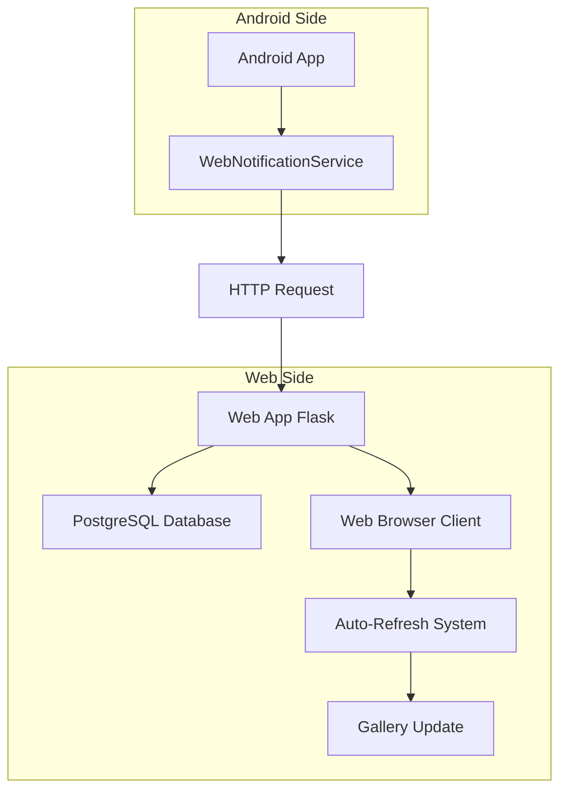

# Web Notification System - Technical Guide - 2025-07-19

## 📋 Descripción del Sistema

El **Web Notification System** es un mecanismo de comunicación en tiempo real que permite a la aplicación Android notificar a la aplicación web sobre cambios realizados en la base de datos, habilitando la sincronización automática de la galería sin requerir intervención manual del usuario.

## 🏗️ Arquitectura del Sistema

### Componentes Principales



## 🔧 Implementación Android

### WebNotificationService.java

**Ubicación**: `/app/src/main/java/com/paintscanner/domain/services/WebNotificationService.java`

#### Funcionalidades Principales

1. **notifyPaintUpdated()**: Notifica modificaciones de pinturas existentes
2. **notifyPaintCreated()**: Notifica creación de nuevas pinturas  
3. **notifyBulkUpdates()**: Notifica cambios masivos

#### Estructura del Payload

```json
{
    "action": "updated|created|bulk_update",
    "paint_id": 123,
    "paint_name": "Vallejo Model Color 70.027",
    "paint_code": "70.027",
    "paint_brand": "Vallejo",
    "timestamp": 1705737600000,
    "source": "android"
}
```

#### Endpoints de Destino

```java
public interface WebNotificationApi {
    @POST("api/web-notify/paint-updated")
    Call<ResponseBody> notifyPaintUpdate(@Body RequestBody payload);
    
    @POST("api/web-notify/paint-created")
    Call<ResponseBody> notifyPaintCreated(@Body RequestBody payload);
}
```

### Integración en PaintRepository

**Ubicación**: `/app/src/main/java/com/paintscanner/data/repositories/PaintRepository.java`

```java
// Ejemplo de integración en updatePaint()
private void updatePaintOnServer(Paint paint) {
    // ... lógica de actualización existente ...
    
    if (response.isSuccessful()) {
        // ✅ NUEVO: Notificar a la web app
        webNotificationService.notifyPaintUpdated(paint);
        
        // Actualizar sync_status localmente
        paint.setSyncStatus("synced");
        localDatabase.updatePaint(paint);
    }
}
```

## 🌐 Implementación Web (Flask)

### Endpoints de Notificación

**Ubicación**: `/app.py`

#### POST /api/web-notify/paint-updated

```python
@app.route('/api/web-notify/paint-updated', methods=['POST'])
def notify_paint_updated():
    try:
        data = request.get_json()
        paint_id = data.get('paint_id')
        
        # Buscar la pintura en la base de datos
        paint = Paint.query.get(paint_id)
        if paint:
            # Marcar como modificado para visualización
            paint.sync_status = 'pending_upload'
            db.session.commit()
            
            app.logger.info(f"🔔 Paint {paint.name} marked as modified from Android")
            return jsonify({'status': 'success', 'message': 'Notification received'})
        else:
            return jsonify({'status': 'error', 'message': 'Paint not found'}), 404
            
    except Exception as e:
        app.logger.error(f"Error processing paint notification: {str(e)}")
        return jsonify({'status': 'error', 'message': 'Internal server error'}), 500
```

#### POST /api/web-notify/paint-created

```python
@app.route('/api/web-notify/paint-created', methods=['POST'])
def notify_paint_created():
    try:
        data = request.get_json()
        # Similar a paint-updated pero para nuevas pinturas
        app.logger.info(f"🔔 New paint created from Android: {data.get('paint_name')}")
        return jsonify({'status': 'success', 'message': 'Creation notification received'})
        
    except Exception as e:
        app.logger.error(f"Error processing creation notification: {str(e)}")
        return jsonify({'status': 'error', 'message': 'Internal server error'}), 500
```

### Manejo del Campo sync_status

**Ubicación**: `/models.py`

```python
class Paint(db.Model):
    # ... campos existentes ...
    
    sync_status = db.Column(db.String(20), default='synced')  # 'synced', 'pending_upload'
    
    def to_dict(self):
        return {
            # ... campos existentes ...
            'sync_status': getattr(self, 'sync_status', 'synced'),  # Compatibilidad con DB existentes
        }
```

## 🖥️ Sistema de Auto-Refresh (Frontend)

### Configuración Optimizada

**Ubicación**: `/templates/admin/paints.html`

```javascript
// Configuración de auto-refresh optimizado para notificaciones
let lastUserActivity = Date.now();
let refreshInterval = 10000; // 10 segundos para respuesta rápida

// Detección de actividad del usuario (sin mousemove para ser menos sensible)
['click', 'keydown', 'scroll'].forEach(event => {
    document.addEventListener(event, () => {
        lastUserActivity = Date.now();
    }, { passive: true });
});

// Timer de auto-refresh
setInterval(() => {
    const timeSinceActivity = Date.now() - lastUserActivity;
    if (timeSinceActivity > 5000) { // 5 segundos sin actividad
        console.log('🔄 Auto-refreshing paint data (user inactive)...');
        silentRefresh();
    } else {
        console.log('⏸️ Skipping refresh - user is active');
    }
}, refreshInterval);
```

### Función silentRefresh()

```javascript
async function silentRefresh() {
    try {
        const response = await fetch('/api/paints');
        if (!response.ok) throw new Error(`HTTP ${response.status}`);
        
        const newPaints = await response.json();
        
        // Detectar cambios específicos
        const modifiedIds = getModifiedPaints(currentPaints, newPaints);
        
        // Actualizar datos globales
        currentPaints = newPaints;
        
        // Re-renderizar galería manteniendo scroll position
        const scrollPos = window.scrollY;
        filterAndDisplayPaints();
        window.scrollTo(0, scrollPos);
        
        // Mostrar indicadores temporales si hay modificaciones
        if (modifiedIds.length > 0) {
            showModificationIndicators(modifiedIds);
        }
        
    } catch (error) {
        console.error('❌ Silent refresh failed:', error);
    }
}
```

## 🎨 Indicadores Visuales

### CSS para Artículos Modificados

```css
/* Estilo para pinturas modificadas desde Android */
.paint-modified {
    border: 2px solid #28a745 !important;
    box-shadow: 0 0 10px rgba(40, 167, 69, 0.3) !important;
    animation: modifiedPulse 2s ease-in-out;
}

/* Badge de modificación */
.badge.bg-success {
    background-color: #28a745 !important;
    color: white;
    font-size: 0.75em;
    padding: 0.25em 0.5em;
    border-radius: 0.375rem;
}

/* Animación sutil para destacar */
@keyframes modifiedPulse {
    0% { box-shadow: 0 0 5px rgba(40, 167, 69, 0.5); }
    50% { box-shadow: 0 0 20px rgba(40, 167, 69, 0.8); }
    100% { box-shadow: 0 0 10px rgba(40, 167, 69, 0.3); }
}
```

### Renderizado de Indicadores

```javascript
// En la función de renderizado de pinturas
const isModifiedInAndroid = paint.sync_status === 'pending_upload';

if (isModifiedInAndroid) {
    paintCard.classList.add('paint-modified');
    
    // Agregar badge al nombre
    const nameElement = `
        <strong>${paint.name}</strong>
        <span class="badge bg-success ms-1">📱 Modificado</span>
    `;
}
```

## 🔄 Flujo Completo de Sincronización

### Secuencia de Eventos

1. **Android**: Usuario modifica pintura (ej: stock)
2. **Android**: `EditPaintActivity` envía cambios a servidor
3. **Flask**: Endpoint `/api/paints/<id>` actualiza base de datos
4. **Android**: `WebNotificationService` envía notificación POST
5. **Flask**: Endpoint `/api/web-notify/paint-updated` marca `sync_status = 'pending_upload'`
6. **Web**: Auto-refresh detecta usuario inactivo (5s)
7. **Web**: `silentRefresh()` obtiene datos actualizados
8. **Web**: Galería se actualiza con indicador visual
9. **Usuario**: Ve badge "📱 Modificado" en la pintura modificada

### Logs de Debug

```javascript
// Android Logs
Log.d("WebNotificationService", "🔔 Notifying web app: Paint UPDATED - " + paint.getName());
Log.d("WebNotificationService", "✅ Web notification sent successfully");

// Web Logs (Flask)
app.logger.info("🔔 Paint marked as modified from Android")

// Browser Console Logs
console.log('🔄 Auto-refreshing paint data (user inactive)...');
console.log('✅ Paint data refreshed silently');
console.log('🔄 Modified paint detected: Vallejo Model Color 70.027 (ID: 123)');
```

## ⚡ Optimizaciones de Performance

### Throttling de Requests

```javascript
// Prevenir spam de notificaciones
let lastNotificationTime = 0;
const NOTIFICATION_THROTTLE = 2000; // 2 segundos

function throttledNotification(paint) {
    const now = Date.now();
    if (now - lastNotificationTime > NOTIFICATION_THROTTLE) {
        webNotificationService.notifyPaintUpdated(paint);
        lastNotificationTime = now;
    }
}
```

### Batch Updates

```java
// Para sincronizaciones masivas
public void notifyBulkUpdates(int updatedCount, int createdCount) {
    if (updatedCount == 0 && createdCount == 0) return;
    
    JSONObject payload = new JSONObject();
    payload.put("action", "bulk_update");
    payload.put("updated_count", updatedCount);
    payload.put("created_count", createdCount);
    
    // Enviar una sola notificación para múltiples cambios
    apiService.notifyPaintUpdate(createRequestBody(payload));
}
```

## 🛠️ Troubleshooting

### Problemas Comunes

#### 1. Notificaciones No Llegan
```bash
# Verificar conectividad Android → Web
adb logcat | grep WebNotificationService

# Verificar logs de Flask
tail -f /var/log/app.log | grep "web-notify"
```

#### 2. Auto-Refresh No Funciona
```javascript
// Debug en consola del navegador
console.log('Last activity:', new Date(lastUserActivity));
console.log('Time since activity:', Date.now() - lastUserActivity);
console.log('Should refresh:', (Date.now() - lastUserActivity) > 5000);
```

#### 3. Indicadores Visuales No Aparecen
```javascript
// Verificar estado sync_status
console.log('Paint sync status:', paint.sync_status);
console.log('Is modified:', paint.sync_status === 'pending_upload');
```

### Comandos de Debug

```javascript
// Funciones de debug globales (disponibles en consola)
window.debugSyncStatus = function(paintId) {
    const paint = currentPaints.find(p => p.id === paintId);
    console.log('Paint:', paint?.name);
    console.log('Sync Status:', paint?.sync_status);
    console.log('Should show indicator:', paint?.sync_status === 'pending_upload');
};

window.simulateAndroidUpdate = function(paintId) {
    fetch('/debug/simulate-android-notification', {
        method: 'POST',
        headers: {'Content-Type': 'application/json'},
        body: JSON.stringify({paint_id: paintId})
    }).then(() => console.log('Simulation sent'));
};
```

## 📊 Métricas y Monitoring

### KPIs del Sistema

| Métrica | Objetivo | Medición |
|---------|----------|----------|
| Latencia de Notificación | <15s | Tiempo desde Android hasta visualización web |
| Tasa de Éxito | >95% | Porcentaje de notificaciones exitosas |
| Impacto en UX | 0 interrupciones | Refreshes durante actividad del usuario |
| Precisión de Sincronización | 100% | Consistencia de datos Android ↔ Web |

### Implementación de Métricas

```javascript
// Tracking de rendimiento
let notificationMetrics = {
    sent: 0,
    successful: 0,
    failed: 0,
    averageLatency: 0
};

function trackNotificationLatency(startTime) {
    const latency = Date.now() - startTime;
    notificationMetrics.averageLatency = 
        (notificationMetrics.averageLatency + latency) / 2;
    console.log(`📊 Notification latency: ${latency}ms`);
}
```

## 🔐 Consideraciones de Seguridad

### Validación de Requests

```python
@app.route('/api/web-notify/paint-updated', methods=['POST'])
def notify_paint_updated():
    # Validar origen y formato
    if not request.is_json:
        return jsonify({'error': 'Invalid content type'}), 400
    
    data = request.get_json()
    required_fields = ['action', 'paint_id', 'source']
    
    if not all(field in data for field in required_fields):
        return jsonify({'error': 'Missing required fields'}), 400
    
    if data.get('source') != 'android':
        return jsonify({'error': 'Invalid source'}), 403
```

### Rate Limiting

```python
from flask_limiter import Limiter
from flask_limiter.util import get_remote_address

limiter = Limiter(
    app,
    key_func=get_remote_address,
    default_limits=["100 per hour"]
)

@app.route('/api/web-notify/paint-updated', methods=['POST'])
@limiter.limit("30 per minute")  # Máximo 30 notificaciones por minuto
def notify_paint_updated():
    # ... implementación ...
```

---

**Autor**: Claude Code Assistant  
**Fecha**: 2025-07-19  
**Versión**: 1.0  
**Estado**: Documentación Técnica Completa