# Android-Web Synchronization Developer Guide - 2025-07-19

## 📋 Introducción

Esta guía técnica detalla el sistema de sincronización bidireccional entre la aplicación Android (Paint Scanner) y la aplicación web (Paint Gallery), proporcionando a los desarrolladores toda la información necesaria para mantener, extender y debuggear el sistema de sincronización.

## 🏗️ Arquitectura de Sincronización

### Visión General del Sistema


## 📱 Lado Android

### 1. Modelo de Datos

**Archivo**: `/app/src/main/java/com/paintscanner/data/database/entities/Paint.java`

```java
@Entity(tableName = "paints")
public class Paint {
    @PrimaryKey(autoGenerate = true)
    private Long id;
    
    @ColumnInfo(name = "remote_id")
    private Long remoteId;  // ID en la base de datos web
    
    @ColumnInfo(name = "sync_status")
    private String syncStatus = "synced";  // "synced", "pending_upload", "conflict"
    
    @ColumnInfo(name = "last_modified")
    private Date lastModified;
    
    // Campos de datos principales
    private String name;
    private String brand;
    private String code;
    private Integer stock;
    private Double price;
    
    // Getters, setters, constructores...
}
```

### 2. Repository Layer

**Archivo**: `/app/src/main/java/com/paintscanner/data/repositories/PaintRepository.java`

#### Operaciones de Sincronización

```java
public class PaintRepository {
    private PaintDao localDao;
    private PaintApiService apiService;
    private WebNotificationService notificationService;
    
    // Subir cambios locales al servidor
    public void syncPaintToServer(Paint paint, OnResultListener<Paint> listener) {
        if (paint.getRemoteId() != null) {
            // Actualizar pintura existente
            updatePaintOnServer(paint, listener);
        } else {
            // Crear nueva pintura
            createPaintOnServer(paint, listener);
        }
    }
    
    private void updatePaintOnServer(Paint paint, OnResultListener<Paint> listener) {
        Call<Paint> call = apiService.updatePaint(paint.getRemoteId(), paint.toRemoteModel());
        call.enqueue(new Callback<Paint>() {
            @Override
            public void onResponse(Call<Paint> call, Response<Paint> response) {
                if (response.isSuccessful()) {
                    Paint updatedPaint = response.body();
                    
                    // ✅ Actualizar base de datos local
                    paint.setSyncStatus("synced");
                    paint.setLastModified(new Date());
                    localDao.updatePaint(paint);
                    
                    // ✅ Notificar a la web app
                    notificationService.notifyPaintUpdated(paint);
                    
                    // ✅ Callback de éxito
                    listener.onResult(updatedPaint);
                } else {
                    handleSyncError(paint, response, listener);
                }
            }
            
            @Override
            public void onFailure(Call<Paint> call, Throwable t) {
                paint.setSyncStatus("pending_upload");
                localDao.updatePaint(paint);
                listener.onError("Network error: " + t.getMessage());
            }
        });
    }
    
    // Obtener cambios del servidor
    public void syncFromServer(OnResultListener<List<Paint>> listener) {
        Call<List<Paint>> call = apiService.getAllPaints();
        call.enqueue(new Callback<List<Paint>>() {
            @Override
            public void onResponse(Call<List<Paint>> call, Response<List<Paint>> response) {
                if (response.isSuccessful()) {
                    List<Paint> serverPaints = response.body();
                    mergePaintsFromServer(serverPaints);
                    listener.onResult(serverPaints);
                }
            }
            
            @Override
            public void onFailure(Call<List<Paint>> call, Throwable t) {
                listener.onError("Failed to sync from server: " + t.getMessage());
            }
        });
    }
    
    // Fusionar datos del servidor con datos locales
    private void mergePaintsFromServer(List<Paint> serverPaints) {
        for (Paint serverPaint : serverPaints) {
            Paint localPaint = localDao.getPaintByRemoteId(serverPaint.getRemoteId());
            
            if (localPaint == null) {
                // Nueva pintura del servidor - insertar localmente
                serverPaint.setSyncStatus("synced");
                localDao.insertPaint(serverPaint);
            } else if (!"pending_upload".equals(localPaint.getSyncStatus())) {
                // Actualizar solo si no hay cambios locales pendientes
                updateLocalPaintFromServer(localPaint, serverPaint);
            }
            // Si hay cambios pendientes, conservar la versión local
        }
    }
}
```

### 3. Service Layer

**Archivo**: `/app/src/main/java/com/paintscanner/domain/services/PaintSyncService.java`

```java
public class PaintSyncService {
    private PaintRepository repository;
    private Context context;
    
    // Sincronización automática en background
    public void performAutoSync() {
        // 1. Subir cambios pendientes
        uploadPendingChanges();
        
        // 2. Descargar cambios del servidor
        downloadServerChanges();
    }
    
    private void uploadPendingChanges() {
        List<Paint> pendingPaints = repository.getPaintsBySyncStatus("pending_upload");
        
        for (Paint paint : pendingPaints) {
            repository.syncPaintToServer(paint, new PaintRepository.OnResultListener<Paint>() {
                @Override
                public void onResult(Paint result) {
                    Log.d(TAG, "✅ Paint uploaded successfully: " + result.getName());
                }
                
                @Override
                public void onError(String error) {
                    Log.e(TAG, "❌ Failed to upload paint: " + error);
                }
            });
        }
    }
    
    // Resolver conflictos de sincronización
    public void resolveConflict(Paint localPaint, Paint serverPaint, ConflictResolution resolution) {
        switch (resolution) {
            case KEEP_LOCAL:
                // Forzar subida de la versión local
                localPaint.setSyncStatus("pending_upload");
                repository.syncPaintToServer(localPaint, null);
                break;
                
            case KEEP_SERVER:
                // Adoptar la versión del servidor
                repository.updateLocalPaintFromServer(localPaint, serverPaint);
                break;
                
            case MERGE:
                // Fusionar campos específicos
                Paint mergedPaint = mergePaintData(localPaint, serverPaint);
                repository.syncPaintToServer(mergedPaint, null);
                break;
        }
    }
}
```

### 4. Presenters (MVP Pattern)

**Archivo**: `/app/src/main/java/com/paintscanner/business/presenters/EditPaintPresenter.java`

```java
public class EditPaintPresenter {
    private EditPaintView view;
    private PaintRepository repository;
    private Paint currentPaint;
    
    public void savePaint(String name, String brand, int stock, double price) {
        // Validar datos
        if (!validatePaintData(name, brand, stock, price)) {
            view.showValidationError("Datos inválidos");
            return;
        }
        
        // Actualizar modelo
        currentPaint.setName(name);
        currentPaint.setBrand(brand);
        currentPaint.setStock(stock);
        currentPaint.setPrice(price);
        currentPaint.setSyncStatus("pending_upload");
        currentPaint.setLastModified(new Date());
        
        view.showLoading();
        
        // Guardar localmente primero
        repository.updatePaintLocally(currentPaint);
        
        // Intentar sincronizar con servidor
        repository.syncPaintToServer(currentPaint, new PaintRepository.OnResultListener<Paint>() {
            @Override
            public void onResult(Paint result) {
                view.hideLoading();
                view.showSuccess("Pintura actualizada correctamente");
                view.finishWithResult(result);
            }
            
            @Override
            public void onError(String error) {
                view.hideLoading();
                view.showWarning("Guardado localmente. Se sincronizará cuando haya conexión.");
                view.finishWithResult(currentPaint);
            }
        });
    }
    
    // Manejar ordenamiento especial para items modificados
    public void loadPaintsForGallery() {
        repository.getAllPaintsSortedByModification(new PaintRepository.OnResultListener<List<Paint>>() {
            @Override
            public void onResult(List<Paint> paints) {
                view.displayPaints(paints);
                
                // Destacar items con sync_status = "pending_upload"
                for (Paint paint : paints) {
                    if ("pending_upload".equals(paint.getSyncStatus())) {
                        view.highlightModifiedPaint(paint);
                    }
                }
            }
            
            @Override
            public void onError(String error) {
                view.showError("Error cargando pinturas: " + error);
            }
        });
    }
}
```

## 🌐 Lado Web (Flask)

### 1. Modelo de Datos

**Archivo**: `/models.py`

```python
class Paint(db.Model):
    __tablename__ = 'paints'
    
    id = db.Column(db.Integer, primary_key=True)
    name = db.Column(db.String(255), nullable=False)
    brand = db.Column(db.String(100))
    color_code = db.Column(db.String(50))
    stock = db.Column(db.Integer, default=0)
    price = db.Column(db.Float)
    
    # Campos de sincronización
    sync_status = db.Column(db.String(20), default='synced')  # 'synced', 'pending_upload'
    created_at = db.Column(db.DateTime, default=datetime.utcnow)
    updated_at = db.Column(db.DateTime, default=datetime.utcnow, onupdate=datetime.utcnow)
    
    def to_dict(self):
        """Conversión a diccionario con manejo de compatibilidad"""
        return {
            'id': self.id,
            'name': self.name,
            'brand': self.brand,
            'color_code': self.color_code,
            'stock': self.stock,
            'price': self.price,
            'sync_status': getattr(self, 'sync_status', 'synced'),  # Compatibilidad con DB sin columna
            'created_at': self.created_at.isoformat() if self.created_at else None,
            'updated_at': self.updated_at.isoformat() if self.updated_at else None,
        }
    
    def update_from_android(self, data):
        """Actualizar campos desde datos de Android"""
        self.name = data.get('name', self.name)
        self.brand = data.get('brand', self.brand)
        self.color_code = data.get('color_code', self.color_code)
        self.stock = data.get('stock', self.stock)
        self.price = data.get('price', self.price)
        self.updated_at = datetime.utcnow()
        
        # Marcar como modificado desde Android para visualización web
        if hasattr(self, 'sync_status'):
            self.sync_status = 'pending_upload'
```

### 2. API Endpoints

**Archivo**: `/app.py`

#### Endpoint Principal de Sincronización

```python
@app.route('/api/paints/<int:paint_id>', methods=['PUT'])
def update_paint(paint_id):
    try:
        data = request.get_json()
        paint = Paint.query.get_or_404(paint_id)
        
        # Log para debugging
        app.logger.info(f"🔄 Updating paint {paint_id} from Android: {data}")
        
        # Actualizar campos
        paint.update_from_android(data)
        
        # Commit a base de datos
        db.session.commit()
        
        app.logger.info(f"✅ Paint {paint.name} updated successfully")
        
        return jsonify({
            'status': 'success',
            'message': 'Paint updated successfully',
            'paint': paint.to_dict()
        })
        
    except Exception as e:
        db.session.rollback()
        app.logger.error(f"❌ Error updating paint {paint_id}: {str(e)}")
        return jsonify({
            'status': 'error',
            'message': f'Error updating paint: {str(e)}'
        }), 500

@app.route('/api/paints', methods=['GET'])
def get_all_paints():
    try:
        paints = Paint.query.all()
        return jsonify([paint.to_dict() for paint in paints])
    except Exception as e:
        app.logger.error(f"Error fetching paints: {str(e)}")
        return jsonify({'error': 'Internal server error'}), 500
```

#### Endpoints de Notificación

```python
@app.route('/api/web-notify/paint-updated', methods=['POST'])
def notify_paint_updated():
    """Recibir notificaciones de Android sobre pinturas actualizadas"""
    try:
        data = request.get_json()
        paint_id = data.get('paint_id')
        
        if not paint_id:
            return jsonify({'error': 'paint_id required'}), 400
        
        paint = Paint.query.get(paint_id)
        if paint:
            # Marcar como modificado para mostrar en web
            if hasattr(paint, 'sync_status'):
                paint.sync_status = 'pending_upload'
                db.session.commit()
            
            app.logger.info(f"🔔 Paint {paint.name} marked as modified from Android")
            
            return jsonify({
                'status': 'success',
                'message': 'Notification received',
                'paint_id': paint_id
            })
        else:
            return jsonify({'error': 'Paint not found'}), 404
            
    except Exception as e:
        app.logger.error(f"Error processing notification: {str(e)}")
        return jsonify({'error': 'Internal server error'}), 500

@app.route('/api/web-notify/paint-created', methods=['POST'])
def notify_paint_created():
    """Recibir notificaciones de Android sobre pinturas creadas"""
    try:
        data = request.get_json()
        app.logger.info(f"🔔 New paint created from Android: {data.get('paint_name')}")
        
        return jsonify({
            'status': 'success',
            'message': 'Creation notification received'
        })
        
    except Exception as e:
        app.logger.error(f"Error processing creation notification: {str(e)}")
        return jsonify({'error': 'Internal server error'}), 500
```

### 3. Sistema de Auto-Refresh

**Archivo**: `/templates/admin/paints.html`

#### Configuración del Polling

```javascript
// Configuración optimizada para sincronización Android-Web
let currentPaints = [];
let lastUserActivity = Date.now();
const REFRESH_INTERVAL = 10000; // 10 segundos
const INACTIVITY_THRESHOLD = 5000; // 5 segundos

// Detección de actividad del usuario
function setupActivityDetection() {
    ['click', 'keydown', 'scroll'].forEach(event => {
        document.addEventListener(event, () => {
            lastUserActivity = Date.now();
        }, { passive: true });
    });
}

// Sistema de auto-refresh
function startAutoRefresh() {
    setInterval(() => {
        const timeSinceActivity = Date.now() - lastUserActivity;
        
        if (timeSinceActivity > INACTIVITY_THRESHOLD) {
            console.log('🔄 Auto-refreshing paint data (user inactive)...');
            performSilentRefresh();
        } else {
            console.log('⏸️ Skipping refresh - user is active');
        }
    }, REFRESH_INTERVAL);
}

// Refresh silencioso sin interrumpir al usuario
async function performSilentRefresh() {
    try {
        const response = await fetch('/api/paints');
        if (!response.ok) {
            throw new Error(`HTTP ${response.status}: ${response.statusText}`);
        }
        
        const newPaints = await response.json();
        
        // Detectar modificaciones específicas
        const modifiedIds = detectModifications(currentPaints, newPaints);
        
        // Actualizar datos globales
        currentPaints = newPaints;
        
        // Mantener posición de scroll
        const scrollPosition = window.scrollY;
        
        // Re-renderizar galería
        renderPaintGallery(newPaints);
        
        // Restaurar scroll
        window.scrollTo(0, scrollPosition);
        
        // Mostrar indicadores para items modificados
        if (modifiedIds.length > 0) {
            showModificationIndicators(modifiedIds);
        }
        
        console.log('✅ Silent refresh completed');
        
    } catch (error) {
        console.error('❌ Silent refresh failed:', error);
    }
}
```

#### Detección de Modificaciones

```javascript
function detectModifications(oldPaints, newPaints) {
    const modifiedIds = [];
    
    newPaints.forEach(newPaint => {
        const oldPaint = oldPaints.find(p => p.id === newPaint.id);
        
        if (oldPaint) {
            // Verificar cambios en campos importantes
            const hasChanges = (
                oldPaint.stock !== newPaint.stock ||
                oldPaint.price !== newPaint.price ||
                oldPaint.name !== newPaint.name ||
                oldPaint.sync_status !== newPaint.sync_status
            );
            
            if (hasChanges) {
                modifiedIds.push(newPaint.id);
                console.log(`🔄 Detected changes in paint: ${newPaint.name} (ID: ${newPaint.id})`);
            }
        } else {
            // Nueva pintura
            modifiedIds.push(newPaint.id);
            console.log(`➕ New paint detected: ${newPaint.name} (ID: ${newPaint.id})`);
        }
    });
    
    return modifiedIds;
}

function showModificationIndicators(modifiedIds) {
    modifiedIds.forEach(paintId => {
        const paintElement = document.querySelector(`[data-paint-id="${paintId}"]`);
        if (paintElement) {
            paintElement.classList.add('paint-modified');
            
            // Remover indicador después de 8 segundos
            setTimeout(() => {
                paintElement.classList.remove('paint-modified');
            }, 8000);
        }
    });
}
```

## 🔄 Flujos de Sincronización

### 1. Modificación de Pintura en Android

```mermaid
sequenceDiagram
    participant U as User
    participant A as Android App
    participant L as Local DB
    participant W as Web API
    participant D as PostgreSQL
    participant B as Browser

    U->>A: Modifica pintura (stock, precio)
    A->>L: Actualizar localmente
    L-->>A: sync_status = "pending_upload"
    A->>W: PUT /api/paints/{id}
    W->>D: UPDATE paints SET ...
    D-->>W: Success
    W-->>A: 200 OK
    A->>L: sync_status = "synced"
    A->>W: POST /api/web-notify/paint-updated
    W->>D: UPDATE sync_status = "pending_upload"
    D-->>W: Success
    W-->>A: Notification received
    
    Note over B: Auto-refresh timer (10s)
    B->>W: GET /api/paints
    W->>D: SELECT * FROM paints
    D-->>W: Paint data with sync_status
    W-->>B: Updated paint list
    B->>B: Render with "📱 Modificado" badge
```



### 2. Sincronización desde Web a Android


### 3. Resolución de Conflictos


## 🐛 Debugging y Troubleshooting

### Herramientas de Debug

#### Android Debug Commands

```java
// En cualquier Activity o Service
public void debugSyncStatus() {
    repository.getAllPaints(new OnResultListener<List<Paint>>() {
        @Override
        public void onResult(List<Paint> paints) {
            for (Paint paint : paints) {
                Log.d("SYNC_DEBUG", String.format(
                    "Paint: %s | Status: %s | RemoteId: %s | LastModified: %s",
                    paint.getName(),
                    paint.getSyncStatus(),
                    paint.getRemoteId(),
                    paint.getLastModified()
                ));
            }
        }
    });
}

// Forzar sincronización completa
public void forceBidirectionalSync() {
    PaintSyncService syncService = new PaintSyncService(context);
    syncService.performFullSync(new SyncCallback() {
        @Override
        public void onSyncComplete(SyncResult result) {
            Log.d("SYNC_DEBUG", "Full sync completed: " + result.toString());
        }
        
        @Override
        public void onSyncError(String error) {
            Log.e("SYNC_DEBUG", "Full sync failed: " + error);
        }
    });
}
```

#### Web Debug Endpoints

```python
@app.route('/debug/sync-status', methods=['GET'])
def debug_sync_status():
    """Endpoint para debugging del estado de sincronización"""
    try:
        paints = Paint.query.all()
        debug_info = []
        
        for paint in paints:
            debug_info.append({
                'id': paint.id,
                'name': paint.name,
                'sync_status': getattr(paint, 'sync_status', 'unknown'),
                'created_at': paint.created_at.isoformat() if paint.created_at else None,
                'updated_at': paint.updated_at.isoformat() if paint.updated_at else None,
            })
        
        return jsonify({
            'total_paints': len(paints),
            'pending_upload': len([p for p in paints if getattr(p, 'sync_status', '') == 'pending_upload']),
            'synced': len([p for p in paints if getattr(p, 'sync_status', 'synced') == 'synced']),
            'paints': debug_info
        })
        
    except Exception as e:
        return jsonify({'error': str(e)}), 500

@app.route('/debug/simulate-android-notification', methods=['POST'])
def simulate_android_notification():
    """Simular notificación de Android para testing"""
    try:
        data = request.get_json()
        paint_id = data.get('paint_id')
        
        paint = Paint.query.get(paint_id)
        if paint and hasattr(paint, 'sync_status'):
            paint.sync_status = 'pending_upload'
            db.session.commit()
            
            return jsonify({
                'status': 'success',
                'message': f'Paint {paint.name} marked as modified for testing'
            })
        else:
            return jsonify({'error': 'Paint not found'}), 404
            
    except Exception as e:
        return jsonify({'error': str(e)}), 500
```

#### Browser Debug Functions

```javascript
// Funciones globales disponibles en consola del navegador
window.debugSync = {
    // Verificar estado de sincronización
    checkPaintStatus: function(paintId) {
        const paint = currentPaints.find(p => p.id === paintId);
        console.log('Paint Status:', {
            id: paint?.id,
            name: paint?.name,
            sync_status: paint?.sync_status,
            should_show_indicator: paint?.sync_status === 'pending_upload'
        });
    },
    
    // Simular modificación desde Android
    simulateAndroidUpdate: async function(paintId) {
        try {
            const response = await fetch('/debug/simulate-android-notification', {
                method: 'POST',
                headers: {'Content-Type': 'application/json'},
                body: JSON.stringify({paint_id: paintId})
            });
            const result = await response.json();
            console.log('Simulation result:', result);
            
            // Forzar refresh para ver cambios
            setTimeout(() => performSilentRefresh(), 1000);
        } catch (error) {
            console.error('Simulation failed:', error);
        }
    },
    
    // Verificar métricas de auto-refresh
    checkAutoRefresh: function() {
        const timeSinceActivity = Date.now() - lastUserActivity;
        console.log('Auto-refresh status:', {
            lastActivity: new Date(lastUserActivity),
            timeSinceActivity: timeSinceActivity + 'ms',
            shouldRefresh: timeSinceActivity > INACTIVITY_THRESHOLD,
            nextRefreshIn: REFRESH_INTERVAL - (Date.now() % REFRESH_INTERVAL) + 'ms'
        });
    },
    
    // Obtener estadísticas de sincronización
    getSyncStats: async function() {
        try {
            const response = await fetch('/debug/sync-status');
            const stats = await response.json();
            console.log('Sync Statistics:', stats);
            return stats;
        } catch (error) {
            console.error('Failed to get sync stats:', error);
        }
    }
};

// Auto-ejecutar al cargar la página
console.log('🔧 Debug tools loaded. Use window.debugSync.* functions');
```

### Logs de Monitoreo

#### Android Logs (LogCat)

```bash
# Filtrar logs de sincronización
adb logcat | grep -E "(SYNC_DEBUG|WebNotificationService|PaintRepository)"

# Filtrar logs específicos de upload
adb logcat | grep "Paint uploaded\|Upload failed\|Notification sent"

# Ver estado de base de datos local
adb logcat | grep "Room\|Database"
```

#### Web Logs (Flask)

```bash
# Logs de sincronización en servidor
tail -f /var/log/app.log | grep -E "(Paint.*updated|web-notify|sync_status)"

# Logs de notificaciones de Android
tail -f /var/log/app.log | grep "🔔"

# Logs de errores de API
tail -f /var/log/app.log | grep -E "(ERROR|❌)"
```

### Problemas Comunes y Soluciones

#### 1. Sincronización Unidireccional

**Síntomas**: 
- Cambios van de Android → Web pero no al revés
- sync_status siempre "synced" en Android

**Diagnóstico**:
```java
// Verificar última sincronización
SharedPreferences prefs = context.getSharedPreferences("sync", Context.MODE_PRIVATE);
long lastSync = prefs.getLong("last_full_sync", 0);
Log.d("SYNC_DEBUG", "Last full sync: " + new Date(lastSync));
```

**Solución**:
```java
// Implementar sincronización periódica desde servidor
public void scheduleServerSync() {
    WorkRequest syncWork = new PeriodicWorkRequest.Builder(
        ServerSyncWorker.class, 
        15, TimeUnit.MINUTES
    ).build();
    
    WorkManager.getInstance(context).enqueue(syncWork);
}
```

#### 2. Conflictos de Datos

**Síntomas**:
- Datos inconsistentes entre Android y Web
- Errores 409 en requests de update

**Diagnóstico**:
```python
# Verificar timestamps en web
@app.route('/debug/paint-timestamps/<int:paint_id>')
def debug_paint_timestamps(paint_id):
    paint = Paint.query.get(paint_id)
    return jsonify({
        'created_at': paint.created_at.isoformat(),
        'updated_at': paint.updated_at.isoformat(),
        'last_android_sync': paint.last_android_sync.isoformat() if hasattr(paint, 'last_android_sync') else None
    })
```

**Solución**:
```java
// Implementar resolución automática de conflictos
public void resolveConflictAutomatically(Paint localPaint, Paint serverPaint) {
    Paint resolvedPaint = new Paint();
    
    // Reglas de fusión automática
    resolvedPaint.setName(serverPaint.getName()); // Prioridad al servidor para nombres
    resolvedPaint.setStock(Math.max(localPaint.getStock(), serverPaint.getStock())); // Stock máximo
    resolvedPaint.setPrice(serverPaint.getPrice()); // Prioridad al servidor para precios
    
    // Timestamp más reciente
    Date latestModified = localPaint.getLastModified().after(serverPaint.getUpdatedAt()) 
        ? localPaint.getLastModified() 
        : serverPaint.getUpdatedAt();
    resolvedPaint.setLastModified(latestModified);
    
    // Subir versión fusionada
    repository.syncPaintToServer(resolvedPaint, null);
}
```

#### 3. Auto-Refresh No Funciona

**Síntomas**:
- Cambios de Android no aparecen en web automáticamente
- Console muestra "user is active" constantemente

**Diagnóstico**:
```javascript
// Debug en consola del navegador
setInterval(() => {
    console.log('Activity debug:', {
        lastActivity: new Date(lastUserActivity),
        timeSince: Date.now() - lastUserActivity,
        threshold: INACTIVITY_THRESHOLD,
        shouldRefresh: (Date.now() - lastUserActivity) > INACTIVITY_THRESHOLD
    });
}, 5000);
```

**Solución**:
```javascript
// Ajustar sensibilidad de detección de actividad
const INACTIVITY_THRESHOLD = 3000; // Reducir a 3 segundos

// O usar refresh forzado para notificaciones críticas
function forceRefreshOnNotification() {
    // Escuchar eventos de notificación específicos
    if (document.hidden === false) { // Solo si la página está visible
        performSilentRefresh();
    }
}
```

## 📊 Monitoreo y Métricas

### KPIs de Sincronización

| Métrica | Objetivo | Cómo Medir |
|---------|----------|------------|
| Latencia de Sincronización | <15 segundos | Tiempo entre cambio Android y visualización Web |
| Tasa de Éxito de Subida | >95% | Ratio de uploads exitosos vs fallidos |
| Consistencia de Datos | 100% | Comparación periódica Android vs Web |
| Conflictos por Día | <5 | Número de conflictos que requieren resolución manual |
| Tiempo de Resolución de Conflictos | <30 segundos | Tiempo promedio para resolver conflictos |

### Implementación de Métricas

```java
// Android - Tracking de métricas
public class SyncMetrics {
    private static long syncStartTime;
    private static int successfulSyncs = 0;
    private static int failedSyncs = 0;
    
    public static void startSyncTimer() {
        syncStartTime = System.currentTimeMillis();
    }
    
    public static void recordSyncSuccess() {
        long latency = System.currentTimeMillis() - syncStartTime;
        successfulSyncs++;
        
        Log.d("METRICS", String.format(
            "Sync completed in %dms. Success rate: %.2f%%",
            latency,
            (float) successfulSyncs / (successfulSyncs + failedSyncs) * 100
        ));
    }
    
    public static void recordSyncFailure(String reason) {
        failedSyncs++;
        Log.w("METRICS", "Sync failed: " + reason);
    }
}
```

```python
# Web - Tracking de métricas
import time
from datetime import datetime, timedelta

class SyncMetrics:
    @staticmethod
    def log_api_call(endpoint, method, response_time, status_code):
        app.logger.info(f"API_METRICS: {method} {endpoint} - {status_code} - {response_time}ms")
    
    @staticmethod
    def get_sync_statistics():
        """Obtener estadísticas de sincronización de las últimas 24 horas"""
        yesterday = datetime.utcnow() - timedelta(days=1)
        
        recent_updates = Paint.query.filter(
            Paint.updated_at >= yesterday
        ).count()
        
        pending_uploads = Paint.query.filter(
            Paint.sync_status == 'pending_upload'
        ).count()
        
        return {
            'recent_updates_24h': recent_updates,
            'pending_uploads': pending_uploads,
            'last_android_notification': get_last_notification_time(),
            'sync_health': 'healthy' if pending_uploads < 10 else 'warning'
        }
```

---

**Autor**: Claude Code Assistant  
**Fecha**: 2025-07-19  
**Versión**: 1.0  
**Estado**: Guía Técnica Completa para Desarrolladores