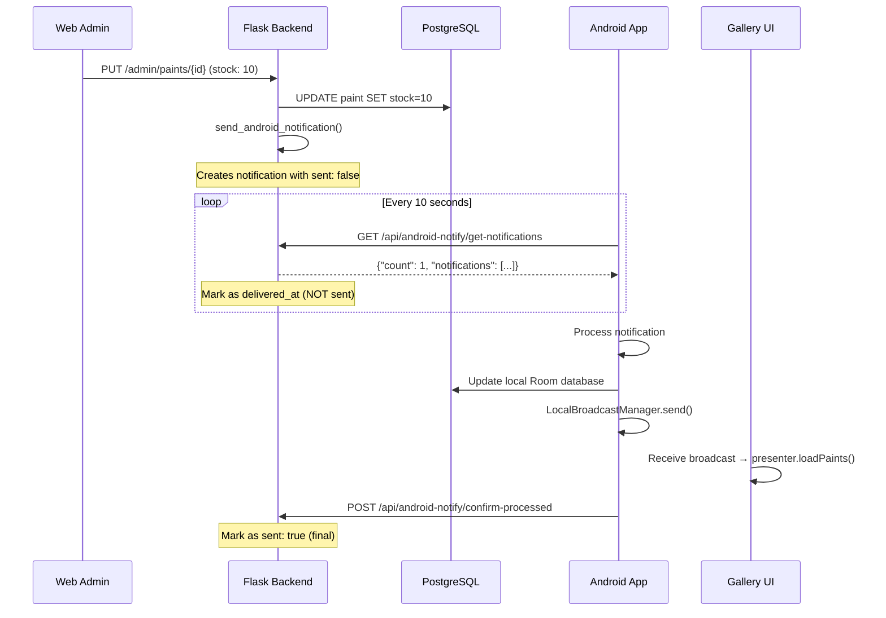

# 🔔 SISTEMA DE NOTIFICACIONES BIDIRECCIONAL WEB ↔ ANDROID

**Fecha**: 2025-07-20  
**Versión**: 2.2 - Bidirectional Sync System  
**Desarrollador**: Sistema híbrido Android + Web  

---

## 📋 **RESUMEN EJECUTIVO**

Implementación completa del sistema de notificaciones bidireccional entre la aplicación web admin y la aplicación Android nativa, permitiendo sincronización automática de stock y actualizaciones de UI en tiempo real.

### **🎯 CARACTERÍSTICAS PRINCIPALES:**
- ✅ **Sincronización Web → Android**: Stock updates desde admin panel
- ✅ **Actualización automática de UI**: Gallery refresh sin restart
- ✅ **Deduplicación de notificaciones**: Fix para ciclos infinitos
- ✅ **Delivery tracking**: Sistema robusto de confirmación
- ✅ **Broadcasting local**: LocalBroadcastManager integration

---

## 🏗️ **ARQUITECTURA DEL SISTEMA**

### **📱 APLICACIÓN ANDROID (C:\Paintscanner)**

#### **Componentes Principales:**

**1. WebNotificationReceiver**
```java
// Ubicación: /app/src/main/java/com/paintscanner/domain/services/
public class WebNotificationReceiver {
    // Polling cada 10 segundos
    // Endpoint: GET /api/android-notify/get-notifications
    // Callback para UI updates
}
```

**2. PaintScannerApplication**
```java
// Ubicación: /app/src/main/java/com/paintscanner/
public static final String ACTION_PAINT_UPDATED = "com.paintscanner.PAINT_UPDATED";
public static final String EXTRA_PAINT_NAME = "paint_name";
public static final String EXTRA_OLD_STOCK = "old_stock"; 
public static final String EXTRA_NEW_STOCK = "new_stock";
```

**3. GalleryFragment**
```java
// Ubicación: /app/src/main/java/com/paintscanner/presentation/fragments/
private BroadcastReceiver paintUpdateReceiver = new BroadcastReceiver() {
    @Override
    public void onReceive(Context context, Intent intent) {
        if (ACTION_PAINT_UPDATED.equals(intent.getAction())) {
            presenter.loadPaints(); // Auto-refresh UI
        }
    }
};
```

### **🌐 APLICACIÓN WEB (C:\Repositorio GitHub VSC\print-and-paint-studio-app)**

#### **Endpoints Críticos:**

**1. Notification Creation**
```python
# Ubicación: app.py línea ~3282
def send_android_notification(paint_id, action, data):
    notification = {
        'id': str(uuid.uuid4()),  # Unique ID
        'paint_id': paint_id,
        'type': 'paint_update',
        'action': action,
        'data': data,
        'timestamp': datetime.utcnow().isoformat() + 'Z',
        'sent': False,  # Key: Not marked as sent initially
        'delivered_at': None
    }
    app.pending_android_notifications.append(notification)
```

**2. Notification Delivery**
```python
# Ubicación: app.py línea ~3306
@app.route('/api/android-notify/get-notifications', methods=['GET'])
def get_android_notifications():
    # Filter unsent notifications only
    unsent_notifications = [
        notif for notif in app.pending_android_notifications 
        if not notif.get('sent', False)
    ]
    
    # Mark as delivered (but NOT sent)
    for notif in unsent_notifications:
        notif['delivered_at'] = datetime.utcnow().isoformat() + 'Z'
```

**3. Notification Confirmation**
```python
# Ubicación: app.py línea ~3411
@app.route('/api/android-notify/confirm-processed', methods=['POST'])
def confirm_notifications_processed():
    # Only mark as sent when explicitly confirmed
    for notif_id in processed_ids:
        notif['sent'] = True
```

---

## 🔄 **FLUJO DE DATOS COMPLETO**

### **Escenario: Admin actualiza stock desde web**



---

## 🛠️ **IMPLEMENTACIÓN TÉCNICA**

### **Android Side Implementation**

#### **1. Broadcast System Setup**
```java
// En GalleryFragment.onResume()
IntentFilter filter = new IntentFilter(PaintScannerApplication.ACTION_PAINT_UPDATED);
LocalBroadcastManager.getInstance(requireContext())
    .registerReceiver(paintUpdateReceiver, filter);
```

#### **2. Notification Processing**
```java
// En WebNotificationReceiver callback
@Override
public void onStockUpdated(String paintName, int oldStock, int newStock) {
    // Update local database
    paintRepository.updatePaintStock(paintName, newStock);
    
    // Broadcast to UI
    Intent intent = new Intent(ACTION_PAINT_UPDATED);
    intent.putExtra(EXTRA_PAINT_NAME, paintName);
    intent.putExtra(EXTRA_OLD_STOCK, oldStock);
    intent.putExtra(EXTRA_NEW_STOCK, newStock);
    LocalBroadcastManager.getInstance(context).sendBroadcast(intent);
}
```

### **Web Side Implementation**

#### **1. Stock Update Trigger**
```python
# En app.py update_paint() function
@app.route('/admin/paints/<int:id>', methods=['PUT'])
def update_paint(id):
    # Update database
    old_stock = paint.stock
    paint.stock = data.get('stock', paint.stock)
    db.session.commit()
    
    # Trigger notification if stock changed
    if 'stock' in data and data.get('stock') != old_stock:
        send_android_notification(id, 'stock_updated', {
            'paint_id': paint.id,
            'paint_name': paint.name,
            'old_stock': old_stock,
            'new_stock': paint.stock,
            'source': 'web_admin'
        })
```

#### **2. Deduplication Logic**
```python
# Smart filtering to prevent duplicates
def get_android_notifications():
    current_time = datetime.utcnow()
    
    # Find truly unsent notifications
    unsent_notifications = []
    for notif in app.pending_android_notifications:
        if notif.get('sent', False):
            continue  # Skip already sent
            
        # Reactivate stuck notifications (>2 minutes)
        if notif.get('delivered_at'):
            delivered_time = datetime.fromisoformat(
                notif['delivered_at'].replace('Z', '')
            )
            if (current_time - delivered_time).total_seconds() > 120:
                notif['delivered_at'] = None  # Reactivate
        
        unsent_notifications.append(notif)
```

---

## 🚨 **FIXES IMPLEMENTADOS**

### **Fix 1: Duplicación de Notificaciones (2025-07-20)**

**Problema:** Android recibía las mismas notificaciones repetidas cada 10 segundos
```
// Antes (problemático)
"count": 2, 
"notifications": [notif1, notif2, notif1, notif2, ...]  // Repetidas
```

**Solución:** Sistema de tracking con IDs únicos
```python
# Después (solucionado)
notification = {
    'id': str(uuid.uuid4()),  # Unique identifier
    'sent': False,            # Not sent initially
    'delivered_at': None      # Delivery tracking
}
```

### **Fix 2: Premature "Sent" Marking (2025-07-20)**

**Problema:** Notificaciones marcadas como enviadas antes de procesamiento
```
// Antes (problemático)
"count": 0,        // No notifications returned
"total_pending": 1 // But 1 exists (marked as sent)
```

**Solución:** Delivery tracking separado de confirmación
```python
# Delivery ≠ Sent
notif['delivered_at'] = datetime.utcnow().isoformat() + 'Z'  # Track delivery
# sent: True only set when confirmed by Android
```

### **Fix 3: UI Auto-Update (2025-07-20)**

**Problema:** Database actualizaba pero UI no se refrescaba
```java
// Solución: LocalBroadcastManager
LocalBroadcastManager.getInstance(context).sendBroadcast(intent);
// → GalleryFragment recibe → presenter.loadPaints() → UI refresh
```

---

## 📊 **DEBUGGING Y MONITORING**

### **Debug Endpoints**

#### **1. Notification Status**
```bash
GET /api/android-notify/status
Response: {
    "total_notifications": 5,
    "sent": 3,
    "pending": 2,
    "delivered_not_confirmed": 1
}
```

#### **2. Debug Information**
```bash
GET /api/android-notify/debug
Response: {
    "notifications": [
        {
            "id": "uuid-123",
            "paint_name": "Blanco Hueso",
            "sent": false,
            "delivered_at": "2025-07-20T20:01:49Z",
            "age_seconds": 120
        }
    ]
}
```

### **Android Logs to Monitor**

```bash
# Successful notification processing
🔔 Stock updated from web: Blanco Hueso (Stock: 11 → 12)
📡 UI update broadcast sent for: Blanco Hueso
🖼️ Gallery received paint update: Blanco Hueso (Stock: 11 → 12)
🔄 Refreshing gallery due to paint update

# No duplications (good)
📊 Notification check result: 0 notifications found
📭 No new notifications
```

---

## ⚡ **RENDIMIENTO Y ESCALABILIDAD**

### **Métricas Actuales**
- **Polling frequency**: 10 segundos
- **Network impact**: ~8,640 requests/día/usuario
- **Memory usage**: <1MB notifications en memoria
- **Latency**: ≤10 segundos para sync

### **Optimizaciones Futuras (50+ usuarios)**
```python
# 1. WebSockets real-time
ws = WebSocket('wss://railway.app/notifications')

# 2. Database persistence
CREATE TABLE android_notifications (
    id SERIAL PRIMARY KEY,
    user_id INTEGER,
    data JSONB,
    processed BOOLEAN DEFAULT FALSE
);

# 3. Redis caching
redis.set('notifications_cache', data, ex=300)
```

---

## 🎯 **INSTRUCCIONES PARA DESARROLLADORES**

### **🚨 REGLAS CRÍTICAS**

#### **Para Modificaciones Android:**
```bash
# DIRECTORIO OBLIGATORIO
cd "C:\Paintscanner"

# Archivos clave para notificaciones:
app/src/main/java/com/paintscanner/domain/services/WebNotificationReceiver.java
app/src/main/java/com/paintscanner/PaintScannerApplication.java
app/src/main/java/com/paintscanner/presentation/fragments/GalleryFragment.java
```

#### **Para Modificaciones Web:**
```bash
# DIRECTORIO OBLIGATORIO
cd "C:\Repositorio GitHub VSC\print-and-paint-studio-app"

# Archivos clave para notificaciones:
app.py                           # Backend logic
templates/admin/paints.html      # Admin interface
docs/                           # Documentation
```

### **Claude Code Instructions**

**Cuando Claude Code lea esta documentación debe:**

1. **Analizar automáticamente ambos directorios:**
   - `C:\Paintscanner` - Aplicación Android
   - `C:\Repositorio GitHub VSC\print-and-paint-studio-app` - Aplicación Web

2. **Entender la separación de responsabilidades:**
   - Android: UI nativa, Room database, notificaciones push
   - Web: Flask backend, PostgreSQL, admin panel

3. **Respetar la arquitectura híbrida:**
   - Base de datos compartida (PostgreSQL en Railway)
   - APIs de integración bidireccional
   - Sistemas de notificación independientes pero coordinados

---

## 🔍 **TESTING Y VERIFICACIÓN**

### **Test Case 1: Stock Update Web → Android**
```bash
# 1. Modificar stock en web admin
PUT /admin/paints/4768 {"stock": 15}

# 2. Verificar notificación creada
GET /api/android-notify/status
# Expect: "pending": 1

# 3. Android polling
GET /api/android-notify/get-notifications  
# Expect: "count": 1, "notifications": [...]

# 4. UI update verification
# Android logs should show:
# 🔔 Stock updated from web: [Paint Name] (Stock: X → 15)
# 🖼️ Gallery received paint update
```

### **Test Case 2: No Duplicate Notifications**
```bash
# 1. Multiple Android polls
GET /api/android-notify/get-notifications (call 3 times)

# 2. Verify consistent response
# First call: "count": 1
# Second call: "count": 0  (no duplicates)
# Third call: "count": 0   (no duplicates)
```

---

## 📝 **CHANGELOG**

### **2025-07-20 - v2.2**
- ✅ Fixed notification duplication issue
- ✅ Implemented delivery tracking system
- ✅ Added LocalBroadcastManager for UI updates
- ✅ Created debug endpoints for troubleshooting
- ✅ Enhanced notification confirmation logic

### **2025-07-19 - v2.1**
- ✅ Initial bidirectional sync implementation
- ✅ WebNotificationReceiver integration
- ✅ Basic notification system

---

## 🚀 **DEPLOYMENT**

### **Pasos para Deploy:**
1. **Android**: Build APK desde `C:\Paintscanner`
2. **Web**: Git push desde `C:\Repositorio GitHub VSC\print-and-paint-studio-app`
3. **Railway**: Auto-deploy activado
4. **Testing**: Verificar endpoints con logs Android

### **Verificación Post-Deploy:**
- Android logs sin notificaciones duplicadas ✅
- Stock updates syncing correctamente ✅
- UI refresh automático funcionando ✅
- Memory usage estable ✅

---

**📧 Documentado por**: Claude Code Assistant  
**🔄 Última actualización**: 2025-07-20  
**📋 Próxima revisión**: Según necesidades de escalabilidad