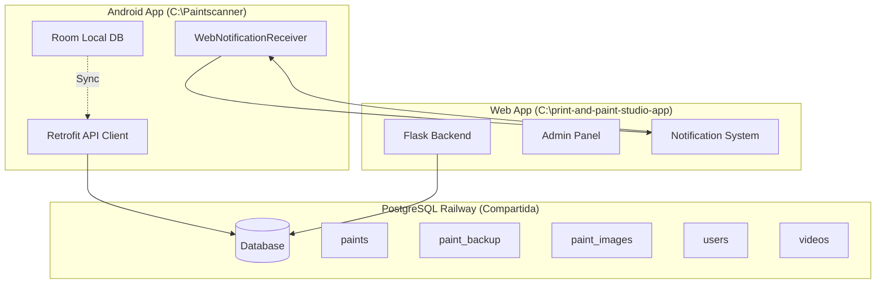
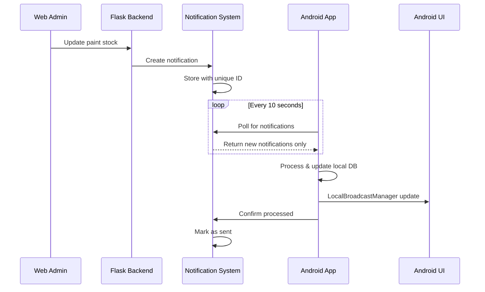

# 🏗️ ARQUITECTURA DE PROYECTOS: SEPARACIÓN DE DIRECTORIOS

**Fecha**: 2025-07-20  
**Versión**: Sistema Híbrido v2.2  
**Tipo**: Documentación Arquitectural Crítica  

---

## 🚨 **INSTRUCCIONES CRÍTICAS PARA CLAUDE CODE**

### **📍 CUANDO CLAUDE CODE LEA ESTA DOCUMENTACIÓN DEBE:**

1. **ANALIZAR AUTOMÁTICAMENTE AMBOS DIRECTORIOS:**
   ```bash
   # DIRECTORIO 1: APLICACIÓN ANDROID
   C:\Paintscanner\
   
   # DIRECTORIO 2: APLICACIÓN WEB  
   C:\Repositorio GitHub VSC\print-and-paint-studio-app\
   ```

2. **ENTENDER LA SEPARACIÓN ABSOLUTA:**
   - ❌ **NUNCA mezclar** archivos entre directorios
   - ✅ **SIEMPRE respetar** la separación de responsabilidades
   - ⚠️ **VERIFICAR directorio** antes de cualquier modificación

3. **APLICAR REGLAS DE DESARROLLO:**
   - **Android**: Solo modificar en `C:\Paintscanner`
   - **Web**: Solo modificar en `C:\Repositorio GitHub VSC\print-and-paint-studio-app`

---

## 🎯 **ARQUITECTURA DEL SISTEMA HÍBRIDO**

### **📱 APLICACIÓN ANDROID (C:\Paintscanner)**

#### **🔧 Responsabilidades Principales:**
- ✅ **Aplicación móvil nativa** Android (Java)
- ✅ **Escáner de códigos de barras** (ML Kit + CameraX)
- ✅ **Base de datos local** (Room Database)
- ✅ **Sincronización con Railway** (Retrofit API calls)
- ✅ **Notificaciones push** desde web admin
- ✅ **UI nativa** (Activities, Fragments, MVP pattern)

#### **🗂️ Estructura de Directorios Android:**
```
C:\Paintscanner\
├── app/                                    # Aplicación Android principal
│   ├── src/main/java/com/paintscanner/
│   │   ├── business/presenters/            # MVP Pattern - Presenters
│   │   │   ├── EditPaintPresenter.java
│   │   │   ├── GalleryPresenter.java
│   │   │   └── ScannerPresenter.java
│   │   │
│   │   ├── data/                           # Capa de datos
│   │   │   ├── database/                   # Room Database local
│   │   │   │   ├── PaintDatabase.java
│   │   │   │   ├── dao/PaintDao.java
│   │   │   │   └── entities/Paint.java
│   │   │   │
│   │   │   ├── remote/                     # APIs y servicios remotos
│   │   │   │   ├── api/
│   │   │   │   │   ├── ImageUploadApiService.java
│   │   │   │   │   ├── PaintImageApiService.java
│   │   │   │   │   └── UPCApiService.java
│   │   │   │   │
│   │   │   │   ├── adapters/
│   │   │   │   │   └── FlaskResponseAdapter.java
│   │   │   │   │
│   │   │   │   └── models/
│   │   │   │       ├── RemotePaint.java
│   │   │   │       ├── PaintImage.java
│   │   │   │       └── UPCResponse.java
│   │   │   │
│   │   │   └── repositories/               # Repository Pattern
│   │   │       └── PaintRepository.java
│   │   │
│   │   ├── domain/services/                # Lógica de negocio
│   │   │   ├── BrandAliasService.java
│   │   │   ├── ImageUploadService.java
│   │   │   ├── PaintImageLookupService.java
│   │   │   ├── PaintSearchService.java
│   │   │   ├── PaintSyncService.java
│   │   │   ├── UPCLookupService.java
│   │   │   └── WebNotificationReceiver.java  # ⭐ CRÍTICO
│   │   │
│   │   ├── presentation/                   # Capa UI
│   │   │   ├── activities/
│   │   │   │   ├── EditPaintActivity.java
│   │   │   │   ├── MainActivity.java
│   │   │   │   ├── PaintDetailActivity.java
│   │   │   │   ├── PendingUploadsActivity.java
│   │   │   │   └── SettingsActivity.java
│   │   │   │
│   │   │   ├── adapters/
│   │   │   │   ├── PaintAdapter.java
│   │   │   │   └── PendingPaintAdapter.java
│   │   │   │
│   │   │   └── fragments/
│   │   │       ├── GalleryFragment.java     # ⭐ CRÍTICO
│   │   │       └── ScannerFragment.java
│   │   │
│   │   ├── utils/                          # Utilidades
│   │   │   ├── MLKitImageProcessor.java
│   │   │   └── PaintDataInitializer.java
│   │   │
│   │   └── PaintScannerApplication.java    # ⭐ CRÍTICO - App entry point
│   │
│   ├── src/main/res/                       # Recursos Android
│   │   ├── drawable/                       # Iconos y gráficos
│   │   ├── layout/                         # XML layouts
│   │   ├── mipmap-*/                       # App icons
│   │   ├── values/                         # Strings, themes, colors
│   │   └── values-*/                       # Localizaciones
│   │
│   └── build.gradle                        # Configuración Android build
│
├── app.py                                  # ⭐ Backend Flask para Android
├── models.py                               # ⭐ Modelos SQLAlchemy Android
├── CLAUDE.md                               # ⭐ Instrucciones proyecto Android
├── requirements.txt                        # Dependencias Python Android
└── [archivos específicos Android]
```

#### **🔑 Archivos Críticos Android:**
- **`PaintScannerApplication.java`**: Entry point, notificaciones, broadcast system
- **`WebNotificationReceiver.java`**: Polling notifications desde web admin
- **`GalleryFragment.java`**: UI refresh automático, LocalBroadcastManager
- **`app.py`**: Backend Flask específico para Android
- **`CLAUDE.md`**: Instrucciones técnicas para Android

---

### **🌐 APLICACIÓN WEB (C:\Repositorio GitHub VSC\print-and-paint-studio-app)**

#### **🔧 Responsabilidades Principales:**
- ✅ **Aplicación web Flask completa**
- ✅ **Panel de administración web** (gestión pinturas, videos)
- ✅ **Sistema de usuarios y autenticación**
- ✅ **Base de datos PostgreSQL** en Railway (compartida)
- ✅ **API endpoints** para sincronización Android
- ✅ **Notificaciones push** hacia Android
- ✅ **Documentación técnica completa**

#### **🗂️ Estructura de Directorios Web:**
```
C:\Repositorio GitHub VSC\print-and-paint-studio-app\
├── templates/                              # Templates HTML
│   ├── admin/                              # Panel administración
│   │   ├── paints.html                     # ⭐ Gestión pinturas web
│   │   ├── videos.html                     # Gestión videos
│   │   ├── categories.html                 # Gestión categorías
│   │   ├── users.html                      # Gestión usuarios
│   │   └── dashboard.html                  # Dashboard admin
│   │
│   ├── user/                               # Panel usuario
│   │   ├── dashboard.html
│   │   ├── favorites.html
│   │   ├── profile.html
│   │   └── videos.html
│   │
│   └── [base templates]                    # Login, registro, index
│       ├── index.html
│       ├── login.html
│       └── register.html
│
├── docs/                                   # ⭐ Documentación técnica completa
│   ├── README.md                           # Documentación principal
│   ├── 42-notification-system-bidirectional-sync-2025-07-20.md
│   ├── 43-notification-deduplication-technical-fix-2025-07-20.md
│   ├── 44-project-architecture-directory-separation-2025-07-20.md
│   ├── performance-optimization-guide.md
│   ├── lazy-loading-implementation.md
│   ├── database-optimization-guide.md
│   ├── architecture-patterns.md
│   ├── troubleshooting-monitoring.md
│   └── [documentos técnicos históricos]
│
├── static/                                 # Archivos estáticos
│   ├── css/
│   ├── js/
│   └── images/
│
├── app.py                                  # ⭐ Backend Flask principal
├── models.py                               # ⭐ Modelos SQLAlchemy completos
├── requirements.txt                        # Dependencias Python web
├── Dockerfile                              # Configuración Docker
├── docker-compose.yml                     # Orchestration
├── railway.toml                           # Railway deployment config
└── [archivos específicos web]
```

#### **🔑 Archivos Críticos Web:**
- **`app.py`**: Backend Flask completo, endpoints API, notificaciones
- **`templates/admin/paints.html`**: Interface web para gestión pinturas
- **`models.py`**: Modelos SQLAlchemy completos con todas las features
- **`docs/`**: Documentación técnica completa del sistema
- **`Dockerfile`**: Configuración deployment Railway

---

## 🔄 **INTEGRACIÓN ENTRE SISTEMAS**

### **📊 Base de Datos Compartida**


### **📡 Sistema de Notificaciones Bidireccional**


---

## ⚠️ **REGLAS CRÍTICAS DE DESARROLLO**

### **🚫 PROHIBIDO - Lo que NUNCA hacer:**

1. **❌ Modificar archivos Android desde directorio Web:**
   ```bash
   # INCORRECTO
   cd "C:\Repositorio GitHub VSC\print-and-paint-studio-app"
   # Modificar cualquier .java file aquí - ¡PROHIBIDO!
   ```

2. **❌ Modificar archivos Web desde directorio Android:**
   ```bash
   # INCORRECTO  
   cd "C:\Paintscanner"
   # Modificar templates HTML aquí - ¡PROHIBIDO!
   ```

3. **❌ Mezclar dependencias entre proyectos:**
   ```bash
   # INCORRECTO
   # Usar requirements.txt de un proyecto en el otro
   ```

4. **❌ Duplicar código entre proyectos:**
   ```bash
   # INCORRECTO
   # Copiar-pegar código entre app.py de Android y Web
   ```

### **✅ OBLIGATORIO - Lo que SIEMPRE hacer:**

1. **✅ Verificar directorio antes de modificar:**
   ```bash
   # CORRECTO - Para modificaciones Android
   cd "C:\Paintscanner"
   pwd  # Verificar ubicación
   # Ahora puedes modificar archivos .java, build.gradle, etc.
   
   # CORRECTO - Para modificaciones Web
   cd "C:\Repositorio GitHub VSC\print-and-paint-studio-app"
   pwd  # Verificar ubicación  
   # Ahora puedes modificar app.py, templates/, docs/, etc.
   ```

2. **✅ Usar APIs de integración para comunicación:**
   ```python
   # CORRECTO - Web comunica con Android via API
   POST /api/android-notify/send-notification
   
   # CORRECTO - Android comunica con Web via API
   GET /api/android-notify/get-notifications
   ```

3. **✅ Mantener sincronizados solo los modelos de datos:**
   ```python
   # CORRECTO - Misma estructura Paint en ambos proyectos
   # Pero implementaciones independientes
   ```

---

## 🎯 **CASOS DE USO POR DIRECTORIO**

### **📱 Trabajar en Android (C:\Paintscanner):**

#### **Cuándo usar este directorio:**
- ✅ Desarrollo de funcionalidades Android nativas
- ✅ Modificación de UI (Activities, Fragments, Layouts)
- ✅ Actualización de servicios de sincronización
- ✅ Configuración de Room Database local
- ✅ Integración con APIs móviles (ML Kit, CameraX)
- ✅ Sistema de notificaciones Android
- ✅ Backend Flask específico para Android

#### **Archivos típicos a modificar:**
```bash
app/src/main/java/com/paintscanner/presentation/fragments/GalleryFragment.java
app/src/main/java/com/paintscanner/domain/services/WebNotificationReceiver.java
app/src/main/java/com/paintscanner/PaintScannerApplication.java
app/src/main/res/layout/fragment_gallery.xml
app.py  # Flask backend para Android
CLAUDE.md  # Instrucciones Android
```

### **🌐 Trabajar en Web (C:\print-and-paint-studio-app):**

#### **Cuándo usar este directorio:**
- ✅ Gestión de videos educativos
- ✅ Panel de administración web
- ✅ Sistema de usuarios y autenticación
- ✅ Templates HTML y frontend
- ✅ Optimizaciones de rendimiento web
- ✅ Documentación técnica
- ✅ Configuración Docker/Railway
- ✅ APIs web y endpoints principales

#### **Archivos típicos a modificar:**
```bash
app.py  # Backend Flask principal
templates/admin/paints.html  # Interface admin
models.py  # Modelos SQLAlchemy completos
docs/  # Documentación
requirements.txt  # Dependencias web
Dockerfile  # Deployment
```

---

## 🛠️ **COMANDOS ESPECÍFICOS POR DIRECTORIO**

### **Android Development Commands:**
```bash
# Navegación al directorio Android
cd "C:\Paintscanner"

# Build y testing Android
./gradlew build
./gradlew clean
./gradlew installDebug
./gradlew test

# Backend Flask Android
python app.py
pip install -r requirements.txt

# Git operations Android
git add app/src/main/java/com/paintscanner/
git commit -m "Android feature update"
```

### **Web Development Commands:**
```bash
# Navegación al directorio Web
cd "C:\Repositorio GitHub VSC\print-and-paint-studio-app"

# Backend Flask Web
python app.py
pip install -r requirements.txt

# Docker operations
docker build -t print-paint-studio .
docker-compose up

# Documentation
# Editar archivos en docs/

# Git operations Web
git add app.py templates/ docs/
git commit -m "Web feature update"
git push  # Auto-deploy a Railway
```

---

## 🔍 **DEBUGGING POR SISTEMA**

### **Android Debugging:**
```bash
# Ubicación: C:\Paintscanner

# Android Studio logs
adb logcat | grep PaintScanner

# Key log patterns
🔔 Stock updated from web: [Paint] (Stock: X → Y)
📡 UI update broadcast sent for: [Paint]
🖼️ Gallery received paint update: [Paint]
🔄 Refreshing gallery due to paint update

# Backend Flask logs (Android)
python app.py
# Check console for API calls from Android
```

### **Web Debugging:**
```bash
# Ubicación: C:\Repositorio GitHub VSC\print-and-paint-studio-app

# Flask logs
python app.py
# Check console for web admin actions

# Railway logs
railway logs

# Browser developer tools
# F12 → Network tab → Monitor API calls

# Key endpoints to monitor
GET /api/android-notify/get-notifications
POST /api/android-notify/confirm-processed
PUT /admin/paints/{id}
```

---

## 📊 **MÉTRICAS Y MONITORING**

### **Android Metrics:**
- **Notification processing time**: <1 segundo
- **UI refresh frequency**: Solo cuando necesario
- **Local DB sync**: Inmediato
- **Memory usage**: <50MB para notifications

### **Web Metrics:**
- **Admin panel response time**: <500ms
- **Notification creation**: <100ms
- **Database queries**: Optimizadas
- **Railway deployment**: <3 minutos

---

## 🚀 **DEPLOYMENT STRATEGIES**

### **Android Deployment:**
```bash
# Desde C:\Paintscanner
./gradlew build
./gradlew installDebug  # Para testing
# Generar APK para distribución
```

### **Web Deployment:**
```bash
# Desde C:\Repositorio GitHub VSC\print-and-paint-studio-app
git add .
git commit -m "Feature update"
git push origin main  # Auto-deploy a Railway
```

---

## 📝 **DOCUMENTACIÓN ESPECÍFICA**

### **Para Android:**
- **Ubicación**: `C:\Paintscanner\CLAUDE.md`
- **Contenido**: Configuración Android, servicios sincronización, arquitectura MVP
- **Audiencia**: Desarrolladores Android, MVP patterns

### **Para Web:**
- **Ubicación**: `C:\Repositorio GitHub VSC\print-and-paint-studio-app\docs\`
- **Contenido**: Optimizaciones rendimiento, arquitectura patterns, troubleshooting
- **Audiencia**: Desarrolladores web, DevOps, arquitectos de sistema

---

## 🔄 **SINCRONIZACIÓN DE MODELOS**

### **Modelo Paint - Coordinado pero Independiente:**

#### **Android Version (C:\Paintscanner\models.py):**
```python
# Enfoque: Stock, códigos, sincronización móvil, EAN scanning
class Paint:
    id = db.Column(db.Integer, primary_key=True)
    name = db.Column(db.String(255), nullable=False)
    color_code = db.Column(db.String(50))
    brand = db.Column(db.String(100))
    stock = db.Column(db.Integer, default=0)  # ⭐ Focus en stock
    ean = db.Column(db.String(13), unique=True, index=True)  # ⭐ EAN scanning support
    sync_status = db.Column(db.String(50))    # ⭐ Mobile sync
```

#### **Web Version (C:\print-and-paint-studio-app\models.py):**
```python
# Enfoque: Gestión completa, usuarios, categorías, EAN management
class Paint:
    id = db.Column(db.Integer, primary_key=True)
    name = db.Column(db.String(255), nullable=False)
    color_code = db.Column(db.String(50))
    brand = db.Column(db.String(100))
    stock = db.Column(db.Integer, default=0)
    ean = db.Column(db.String(13), unique=True, index=True)  # ⭐ EAN field with unique constraint
    # ⭐ Additional web-specific fields
    description = db.Column(db.Text)
    price = db.Column(db.Float)
    color_family = db.Column(db.String(100))
    created_at = db.Column(db.DateTime)
```

---

## ⚡ **PERFORMANCE CONSIDERATIONS**

### **Android Performance:**
- **Local caching**: Room Database
- **Minimal network calls**: Solo cuando necesario
- **Efficient UI updates**: DiffUtil en RecyclerView
- **Background processing**: WebNotificationReceiver

### **Web Performance:**
- **Database indexing**: PostgreSQL optimizado
- **Template caching**: Flask optimizations
- **Static file serving**: Optimized delivery
- **API response caching**: Reduced latency

---

## 🎯 **INSTRUCCIONES PARA CLAUDE CODE**

### **🤖 Al leer esta documentación, Claude Code debe:**

1. **Verificar directorio actual** antes de cualquier operación
2. **Analizar ambos proyectos** automáticamente al inicio
3. **Respetar separación** absoluta entre Android y Web
4. **Usar APIs de integración** para comunicación entre sistemas
5. **Mantener documentación actualizada** en directorio correspondiente

### **🔍 Proceso de análisis automático:**
```bash
# 1. Detectar contexto del usuario
if (user_mentions_android_features):
    working_directory = "C:\Paintscanner"
    focus = "Android native development"
elif (user_mentions_web_admin):
    working_directory = "C:\Repositorio GitHub VSC\print-and-paint-studio-app"
    focus = "Web application development"

# 2. Analizar estructura de ambos proyectos
analyze_directory("C:\Paintscanner")
analyze_directory("C:\Repositorio GitHub VSC\print-and-paint-studio-app")

# 3. Entender arquitectura híbrida
understand_integration_apis()
understand_shared_database()
understand_notification_system()
```

---

## 📋 **CHECKLIST DE VERIFICACIÓN**

### **Antes de cualquier modificación:**
- [ ] ✅ Verificar directorio correcto
- [ ] ✅ Confirmar tipo de funcionalidad (Android vs Web)
- [ ] ✅ Revisar arquitectura de integración
- [ ] ✅ Verificar APIs de comunicación
- [ ] ✅ Confirmar no hay conflictos entre sistemas

### **Después de modificaciones:**
- [ ] ✅ Testing en directorio correcto
- [ ] ✅ Verificar no afecta al otro sistema
- [ ] ✅ Documentar cambios en ubicación adecuada
- [ ] ✅ Deployment al sistema correspondiente
- [ ] ✅ Monitorear integración entre sistemas

---

## 🚨 **ALERTAS Y WARNINGS**

### **🔴 CRÍTICO - Errores comunes a evitar:**
1. **Mixed directory operations**: Modificar Android desde directorio Web
2. **Cross-contamination**: Copiar código entre proyectos sin adaptación
3. **Broken APIs**: Cambiar endpoints sin actualizar ambos lados
4. **Documentation drift**: Documentar en ubicación incorrecta

### **🟡 WARNING - Cosas a vigilar:**
1. **Model synchronization**: Mantener modelos coordinados
2. **API versioning**: Cambios que afecten integración
3. **Database migrations**: Impacto en ambos sistemas
4. **Performance impact**: Optimizaciones que afecten al otro sistema

---

**🏗️ Documentado por**: Claude Code Assistant  
**📅 Fecha**: 2025-07-20  
**🎯 Objetivo**: Arquitectura híbrida robusta y mantenible  
**🔄 Revisión**: Cada major release o cambio arquitectural