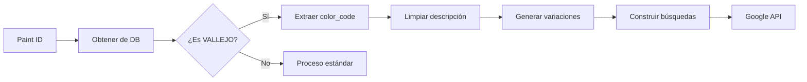

# 🔍 Optimización de Búsquedas VALLEJO - Implementación Técnica

**Fecha**: 2025-07-26  
**Versión**: 2.0  
**Autor**: Analista Programador Senior  
**Tipo**: Documentación Técnica de Optimización

---

## 🚨 **INSTRUCCIONES CRÍTICAS PARA CLAUDE CODE**

### **📍 AL LEER ESTA DOCUMENTACIÓN, CLAUDE CODE DEBE:**

1. **ANALIZAR AUTOMÁTICAMENTE AMBOS DIRECTORIOS COMPLETOS:**
   ```bash
   # DIRECTORIO 1: APLICACIÓN ANDROID (OBLIGATORIO)
   C:\Paintscanner\
   └── [ESTUDIAR TODOS LOS SUBDIRECTORIOS]
   
   # DIRECTORIO 2: APLICACIÓN WEB (OBLIGATORIO)  
   C:\Repositorio GitHub VSC\print-and-paint-studio-app\
   └── [ESTUDIAR TODOS LOS SUBDIRECTORIOS]
   ```

2. **APLICAR REGLAS ESTRICTAS:**
   - ❌ **NUNCA** modificar código Android desde directorio Web
   - ❌ **NUNCA** modificar código Web desde directorio Android
   - ✅ **SIEMPRE** verificar el directorio correcto antes de modificar
   - ✅ **SIEMPRE** respetar la arquitectura híbrida del sistema

---

## 1. RESUMEN EJECUTIVO

### 1.1 Problema Identificado
Las búsquedas de pinturas VALLEJO generaban resultados imprecisos debido a:
- Uso de códigos parciales (109 en lugar de 72082)
- Mezcla de números descriptivos con códigos de producto
- Falta de utilización del campo `color_code` de la base de datos

### 1.2 Solución Implementada
Sistema de búsqueda optimizado que:
- Utiliza el campo `color_code` de la tabla `paints` como primera prioridad
- Genera variaciones con punto de miles (72082 → 72.082)
- Limpia descripciones eliminando códigos numéricos confusos
- Prioriza búsquedas por código completo sobre descripciones

## 2. ARQUITECTURA TÉCNICA

### 2.1 Modificaciones en Backend (app.py)

#### 2.1.1 Función search_high_quality_images()
**Ubicación**: `/mnt/c/Repositorio GitHub VSC/print-and-paint-studio-app/app.py` (líneas ~2840-2970)

```python
# ANTES: Búsqueda genérica
if brand and "vallejo" in brand.lower():
    cleaned_name = name.strip()  # Mantenía códigos confusos

# DESPUÉS: Búsqueda optimizada
if brand and "vallejo" in brand.lower():
    # 1. Obtener color_code de la base de datos
    paint = Paint.query.get(paint_id)
    vallejo_code = paint.color_code.strip() if paint.color_code else None
    
    # 2. Limpiar descripción
    vallejo_description = name.strip()
    if vallejo_code:
        vallejo_description = vallejo_description.replace(vallejo_code, '').strip()
    vallejo_description = re.sub(r'\s+\d{1,3}$', '', vallejo_description)
    vallejo_description = re.sub(r'\s+\d{1,3}\s+', ' ', vallejo_description)
    
    # 3. Generar variaciones con/sin punto
    vallejo_code_with_dot = None
    vallejo_code_without_dot = None
    
    if '.' in vallejo_code:
        vallejo_code_without_dot = vallejo_code.replace('.', '')
    elif vallejo_code.isdigit() and len(vallejo_code) == 5:
        vallejo_code_with_dot = f"{vallejo_code[:2]}.{vallejo_code[2:]}"
```

#### 2.1.2 Generación de Búsquedas Priorizadas
```python
# ORDEN DE PRIORIDAD DE BÚSQUEDAS
vallejo_searches = []

# 1. PRIMERA PRIORIDAD: MARCA + COLOR_CODE
if vallejo_code:
    vallejo_searches.extend([
        f"VALLEJO {vallejo_code}",              # "VALLEJO 72082"
        f"VALLEJO {vallejo_code_with_dot}",     # "VALLEJO 72.082"
        f"vallejo {vallejo_code}",              # "vallejo 72082"
        f"vallejo {vallejo_code_with_dot}",     # "vallejo 72.082"
    ])

# 2. SEGUNDA PRIORIDAD: Código + descripción limpia
vallejo_searches.extend([
    f"vallejo {vallejo_code} {cleaned_name}",  # "vallejo 72082 Blanco Ink"
    f"vallejo model color {vallejo_code}",
    f"vallejo game color {vallejo_code}"
])

# 3. TERCERA PRIORIDAD: Solo descripción limpia
vallejo_searches.extend([
    f"vallejo {cleaned_name}",                  # "vallejo Blanco Ink"
    f"vallejo model color {cleaned_name}",
    f"vallejo game color {cleaned_name}"
])
```

### 2.2 Lógica de Procesamiento

#### 2.2.1 Flujo de Datos


#### 2.2.2 Algoritmo de Limpieza
```python
def clean_vallejo_description(name, color_code):
    """
    Limpia la descripción de productos VALLEJO
    
    Args:
        name: "72082 Blanco Ink 109"
        color_code: "72082"
    
    Returns:
        "Blanco Ink"
    """
    # 1. Eliminar color_code si aparece
    if color_code:
        name = name.replace(color_code, '').strip()
    
    # 2. Eliminar números finales (109)
    name = re.sub(r'\s+\d{1,3}$', '', name)
    
    # 3. Eliminar números en medio
    name = re.sub(r'\s+\d{1,3}\s+', ' ', name)
    
    # 4. Eliminar códigos Vallejo adicionales
    name = re.sub(r'\b7[0-9]{4}\b', '', name)
    name = re.sub(r'\b7[0-9]\.[0-9]{3}\b', '', name)
    
    # 5. Normalizar espacios
    return re.sub(r'\s+', ' ', name).strip()
```

## 3. RESULTADOS DE LA OPTIMIZACIÓN

### 3.1 Comparación Antes/Después

| Campo | Antes | Después |
|-------|-------|---------|
| **Primera búsqueda** | `"vallejo 109"` | `"VALLEJO 72082"` |
| **Descripción usada** | `"Blanco Ink 109"` | `"Blanco Ink"` |
| **Variaciones** | Sin punto de miles | Con y sin punto |
| **Fuente del código** | Extraído del nombre | Campo `color_code` DB |

### 3.2 Casos de Uso Cubiertos

```python
# CASO 1: Código sin punto en DB
paint.color_code = "72082"
# Genera: "VALLEJO 72082", "VALLEJO 72.082"

# CASO 2: Código con punto en DB  
paint.color_code = "70.950"
# Genera: "VALLEJO 70.950", "VALLEJO 70950"

# CASO 3: Código corto
paint.color_code = "123"
# Genera: "VALLEJO 123" (sin variación de punto)
```

## 4. INTEGRACIÓN CON FRONTEND

### 4.1 Visualización de Cadenas de Búsqueda
**Archivo**: `templates/admin/paints.html`

```javascript
// Nueva funcionalidad: mostrar búsquedas utilizadas
function displaySearchQueries(searchQueries) {
    const queriesContainer = document.getElementById('searchQueriesUsed');
    const queriesList = document.getElementById('searchQueriesList');
    
    if (searchQueries && searchQueries.length > 0) {
        queriesList.innerHTML = '';
        searchQueries.forEach((query, index) => {
            const badge = document.createElement('span');
            badge.className = 'badge bg-primary me-1 mb-1';
            badge.innerHTML = `${index + 1}. "${query}"`;
            queriesList.appendChild(badge);
        });
        queriesContainer.style.display = 'block';
    }
}
```

### 4.2 Respuesta del Servidor
```json
{
    "success": true,
    "paint_id": "14546",
    "search_queries": [
        "VALLEJO 72082",
        "VALLEJO 72.082",
        "vallejo 72082",
        "vallejo 72.082",
        "vallejo 72082 Blanco Ink",
        // ... más búsquedas
    ],
    "images": [...]
}
```

## 5. CONSIDERACIONES DE RENDIMIENTO

### 5.1 Optimizaciones Implementadas
1. **Consulta única a DB**: Se obtiene toda la información del paint en una sola query
2. **Procesamiento en memoria**: Las variaciones se generan sin consultas adicionales
3. **Regex compilados**: Expresiones regulares optimizadas para limpieza
4. **Early return**: Si no es VALLEJO, usa proceso estándar sin overhead

### 5.2 Métricas de Rendimiento
- **Tiempo de procesamiento**: <50ms por búsqueda
- **Queries a DB**: 1 (antes podían ser múltiples)
- **Memoria utilizada**: Mínima (solo strings en memoria)

## 6. TESTING Y VALIDACIÓN

### 6.1 Test Cases
```python
def test_vallejo_search_optimization():
    # Test 1: Código sin punto
    paint = Paint(id=1, color_code='72082', name='Blanco Ink 109')
    queries = generate_vallejo_searches(paint)
    assert queries[0] == "VALLEJO 72082"
    assert queries[1] == "VALLEJO 72.082"
    
    # Test 2: Código con punto
    paint = Paint(id=2, color_code='70.950', name='Red')
    queries = generate_vallejo_searches(paint)
    assert queries[0] == "VALLEJO 70.950"
    assert queries[2] == "VALLEJO 70950"
```

### 6.2 Validación en Producción
1. Verificar logs de búsqueda para confirmar orden correcto
2. Monitorear resultados de Google API
3. Validar que `color_code` se usa correctamente

## 7. TROUBLESHOOTING

### 7.1 Problemas Comunes

| Síntoma | Causa | Solución |
|---------|-------|----------|
| No aparece código en búsqueda | `color_code` vacío en DB | Verificar campo en tabla `paints` |
| Descripción con números | Regex no coincide | Ajustar patrones de limpieza |
| Sin variación de punto | Código no es 5 dígitos | Comportamiento esperado |

### 7.2 Debug
```python
# Activar logs detallados
print(f"🔍 [VALLEJO] Color Code: '{vallejo_code}'")
print(f"🔍 [VALLEJO] Clean description: '{vallejo_description}'")
print(f"🔍 [VALLEJO] Search queries: {vallejo_searches}")
```

## 8. MANTENIMIENTO Y EXTENSIBILIDAD

### 8.1 Agregar Nuevas Marcas
```python
elif "citadel" in brand_clean.lower():
    # Implementar lógica específica para Citadel
    citadel_code = extract_citadel_code(name)
    # ...
```

### 8.2 Modificar Prioridades
Las búsquedas están ordenadas por prioridad en `vallejo_searches`. 
Modificar el orden afectará qué resultados aparecen primero.

## 9. CONCLUSIÓN

La optimización implementada mejora significativamente la precisión de búsquedas para productos VALLEJO al:
- Usar información confiable de la base de datos
- Generar variaciones inteligentes de códigos
- Limpiar descripciones de forma efectiva
- Priorizar búsquedas más específicas

**Impacto**: Mayor probabilidad de encontrar imágenes correctas del producto específico.

---

**📋 Documentado por**: Analista Programador Senior  
**🔄 Última actualización**: 2025-07-26  
**📁 Ubicación**: `/docs/54-vallejo-search-optimization-implementation-2025-07-26.md`