# 🚫 Sistema de Fallback para Cuota de Google API - Documentación Técnica

**Fecha**: 2025-07-26  
**Versión**: 1.0  
**Autor**: Analista Programador Senior  
**Tipo**: Implementación de Sistema de Contingencia

---

## 🚨 **INSTRUCCIONES CRÍTICAS PARA CLAUDE CODE**

### **📍 ATENCIÓN - DIRECTORIOS DE TRABAJO:**

```bash
# APLICACIÓN WEB (ESTE DOCUMENTO SE APLICA AQUÍ)
C:\Repositorio GitHub VSC\print-and-paint-studio-app\
├── app.py                  # Backend con fallback
├── templates/              # Frontend con manejo de errores
└── static/                 # Assets

# APLICACIÓN ANDROID (NO MODIFICAR DESDE AQUÍ)
C:\Paintscanner\
└── [NO TOCAR - Sistema independiente]
```

**⚠️ IMPORTANTE**: Esta funcionalidad es EXCLUSIVA de la aplicación web.

---

## 1. CONTEXTO DEL PROBLEMA

### 1.1 Error Detectado
```json
{
    "error": {
        "code": 429,
        "message": "Quota exceeded for quota metric 'Queries' and limit 'Queries per day'",
        "status": "RESOURCE_EXHAUSTED",
        "details": [{
            "reason": "RATE_LIMIT_EXCEEDED",
            "domain": "googleapis.com",
            "metadata": {
                "quota_limit_value": "100",
                "service": "customsearch.googleapis.com"
            }
        }]
    }
}
```

### 1.2 Limitaciones de Google Custom Search API
- **Cuota gratuita**: 100 queries/día
- **Reseteo**: Diario a las 00:00 UTC
- **Sin warning previo**: Falla abruptamente al alcanzar límite

## 2. ARQUITECTURA DE LA SOLUCIÓN

### 2.1 Detección de Error (Backend)

**Archivo**: `app.py` (líneas ~3143-3163)

```python
# Detección específica del error 429
if response.status_code == 429 or "quota exceeded" in response.text.lower():
    print(f"🚫 [IMAGE SEARCH] QUOTA EXCEEDED - Google API daily limit reached")
    break  # Salir del bucle de consultas

# Detección en excepciones
except Exception as api_error:
    if "quota" in str(api_error).lower() or "rate limit" in str(api_error).lower():
        print(f"🚫 [IMAGE SEARCH] QUOTA EXCEEDED in exception")
        break
```

### 2.2 Sistema de Fallback

#### 2.2.1 Generación de Enlaces de Búsqueda
```python
# Fallback cuando len(images) == 0
if len(images) == 0:
    print(f"🔍 [IMAGE SEARCH] Google API failed, providing fallback solutions...")
    
    fallback_searches = []
    
    # URLs específicas para VALLEJO
    if "vallejo" in brand_clean.lower() and vallejo_code:
        fallback_searches.extend([
            f"https://acrylicosvallejo.com/search?q={vallejo_code}",
            f"https://www.greenstuffworld.com/en/search?controller=search&s={vallejo_code}",
            f"https://www.google.com/search?q=VALLEJO+{vallejo_code}&tbm=isch",
            f"https://www.google.com/search?q=vallejo+{vallejo_code}+paint&tbm=isch"
        ])
    
    # Búsquedas genéricas
    fallback_searches.extend([
        f"https://www.google.com/search?q={brand_clean}+{cleaned_name}+paint&tbm=isch",
        f"https://duckduckgo.com/?q={brand_clean}+{cleaned_name}+miniature+paint&ia=images",
        f"https://www.bing.com/images/search?q={brand_clean}+{cleaned_name}+acrylic"
    ])
```

#### 2.2.2 Estructura de Datos de Fallback
```python
# Crear objetos "imagen" especiales
for search_url in fallback_searches[:6]:
    images.append({
        'url': search_url,              # URL de búsqueda, no imagen
        'title': f"Buscar '{brand_clean} {cleaned_name}' en {site_name}",
        'source': search_url,
        'width': 400,
        'height': 400,
        'site': site_name,
        'category': category,
        'is_search_link': True          # ⚠️ Indicador crítico
    })
```

### 2.3 Manejo en Frontend

#### 2.3.1 Detección de Enlaces de Búsqueda
**Archivo**: `templates/admin/paints.html` (líneas ~4150-4156)

```javascript
// Verificar si es un enlace de búsqueda
const isSearchLink = image.is_search_link || 
    image.url.includes('google.com/search') || 
    image.url.includes('duckduckgo.com') || 
    image.url.includes('bing.com') ||
    image.url.includes('acrylicosvallejo.com') ||
    image.url.includes('greenstuffworld.com');
```

#### 2.3.2 Renderizado Diferenciado
```javascript
if (isSearchLink) {
    cardHTML = `
        <div class="card h-100 search-link-card" 
             style="cursor: pointer; border: 2px dashed #007bff;">
            <div class="card-img-container" 
                 style="height: 200px; 
                        background: linear-gradient(135deg, #007bff, #0056b3); 
                        display: flex; 
                        align-items: center; 
                        justify-content: center;">
                <div class="text-center">
                    <i class="bi bi-search" style="font-size: 3rem; color: white;"></i>
                    <h6 class="text-white">Buscar Manualmente</h6>
                    <small class="text-light">Haz clic para abrir búsqueda</small>
                </div>
            </div>
        </div>
    `;
}
```

#### 2.3.3 Comportamiento al Clic
```javascript
function selectImage(imageUrl, index) {
    // Verificar si es enlace de búsqueda
    if (imageUrl.includes('google.com/search') || 
        imageUrl.includes('duckduckgo.com') || 
        imageUrl.includes('bing.com') || 
        imageUrl.includes('acrylicosvallejo.com') ||
        imageUrl.includes('greenstuffworld.com')) {
        
        console.log(`🔗 [IMAGE SEARCH] Opening search link: ${imageUrl}`);
        window.open(imageUrl, '_blank');  // Abrir en nueva pestaña
        return;
    }
    
    // Comportamiento normal para imágenes reales
    // ...
}
```

### 2.4 Notificación al Usuario

#### 2.4.1 Mensaje de Cuota Agotada
```javascript
function showQuotaExceededMessage() {
    const alertHTML = `
        <div class="alert alert-warning alert-dismissible fade show mt-3">
            <i class="bi bi-exclamation-triangle-fill me-2"></i>
            <strong>Cuota de Google API Agotada</strong><br>
            Se han usado las 100 búsquedas diarias gratuitas. 
            Los enlaces mostrados abajo te permitirán buscar manualmente.
            La cuota se restablece automáticamente mañana.
            <button type="button" class="btn-close" data-bs-dismiss="alert"></button>
        </div>
    `;
    
    // Insertar antes de la galería
    const gallery = document.getElementById('imageGallery');
    if (gallery && !document.querySelector('.quota-exceeded-alert')) {
        const alertDiv = document.createElement('div');
        alertDiv.className = 'quota-exceeded-alert';
        alertDiv.innerHTML = alertHTML;
        gallery.parentNode.insertBefore(alertDiv, gallery);
    }
}
```

## 3. FLUJO DE TRABAJO COMPLETO

```mermaid
graph TD
    A[Usuario busca imagen] --> B[Backend llama Google API]
    B --> C{¿Respuesta OK?}
    C -->|Sí| D[Mostrar imágenes normales]
    C -->|No - Error 429| E[Detectar cuota agotada]
    E --> F[Generar enlaces fallback]
    F --> G[Marcar como is_search_link]
    G --> H[Frontend detecta enlaces]
    H --> I[Mostrar tarjetas especiales]
    I --> J[Usuario hace clic]
    J --> K[Abrir búsqueda en nueva pestaña]
```



## 4. CASOS DE USO Y PRIORIDADES

### 4.1 Prioridad de Enlaces de Fallback

1. **Sitios oficiales de marca** (máxima prioridad)
   - `acrylicosvallejo.com` para VALLEJO
   - Sitios oficiales de otras marcas

2. **Tiendas especializadas**
   - `greenstuffworld.com`
   - Otras tiendas de miniaturas

3. **Motores de búsqueda generales**
   - Google Images
   - DuckDuckGo
   - Bing

### 4.2 URLs Generadas por Marca

```python
# VALLEJO con código 72082
fallback_urls = [
    "https://acrylicosvallejo.com/search?q=72082",
    "https://www.greenstuffworld.com/en/search?controller=search&s=72082",
    "https://www.google.com/search?q=VALLEJO+72082&tbm=isch"
]

# Otras marcas
fallback_urls = [
    "https://www.google.com/search?q=CITADEL+Abaddon+Black&tbm=isch",
    "https://duckduckgo.com/?q=CITADEL+Abaddon+Black+paint&ia=images"
]
```

## 5. TESTING Y VALIDACIÓN

### 5.1 Simular Cuota Agotada
```python
# En app.py, temporalmente forzar fallback
if True:  # Cambiar a if len(images) == 0: en producción
    # Código de fallback
```

### 5.2 Verificación de UI
1. Las tarjetas de búsqueda deben tener borde azul punteado
2. El icono de búsqueda debe ser visible y grande
3. Al hacer clic debe abrir nueva pestaña
4. El mensaje de cuota agotada debe aparecer

### 5.3 Test Automatizados
```javascript
// Test de detección de enlaces
function testSearchLinkDetection() {
    const testCases = [
        { url: "https://google.com/search?q=test", expected: true },
        { url: "https://example.com/image.jpg", expected: false },
        { url: "https://acrylicosvallejo.com/search?q=123", expected: true }
    ];
    
    testCases.forEach(test => {
        const isSearch = test.url.includes('google.com/search') || 
                        test.url.includes('acrylicosvallejo.com');
        console.assert(isSearch === test.expected, 
                      `Failed for ${test.url}`);
    });
}
```

## 6. MONITOREO Y MÉTRICAS

### 6.1 Logs a Monitorear
```bash
# Backend logs
grep "QUOTA EXCEEDED" app.log
grep "fallback search links" app.log

# Contar usos diarios
grep "Google API search" app.log | wc -l
```

### 6.2 Métricas Clave
- **Quota usage**: Queries usadas vs límite (100/día)
- **Fallback triggers**: Veces que se activa el fallback
- **User clicks**: Enlaces de búsqueda clickeados
- **Success rate**: Imágenes encontradas vs fallbacks

## 7. OPTIMIZACIONES FUTURAS

### 7.1 Cache de Resultados
```python
# Implementar cache para reducir queries
@cache.memoize(timeout=3600)  # 1 hora
def search_images_cached(brand, name, color_code):
    return search_high_quality_images(brand, name, color_code)
```

### 7.2 Quota Management
```python
# Trackear uso de quota
class QuotaManager:
    def __init__(self):
        self.daily_queries = 0
        self.reset_time = datetime.utcnow().replace(hour=0, minute=0)
    
    def can_query(self):
        if datetime.utcnow() > self.reset_time + timedelta(days=1):
            self.daily_queries = 0
            self.reset_time = datetime.utcnow().replace(hour=0, minute=0)
        
        return self.daily_queries < 95  # Dejar margen
```

## 8. CONCLUSIÓN

El sistema de fallback implementado garantiza que:
- Los usuarios siempre tienen opciones para buscar imágenes
- La experiencia no se interrumpe por límites de API
- Los enlaces priorizan fuentes oficiales y relevantes
- La UI comunica claramente el estado al usuario

**Impacto**: Continuidad del servicio incluso sin cuota de API disponible.

---

**📋 Documentado por**: Analista Programador Senior  
**🔄 Última actualización**: 2025-07-26  
**📁 Ubicación**: `/docs/55-google-api-quota-fallback-system-2025-07-26.md`