# 📱 Sistema de Actualización Masiva de Estado de Sincronización

**Fecha**: 2025-07-26  
**Versión**: 1.0  
**Autor**: Analista Programador Senior  
**Tipo**: Implementación de Funcionalidad Crítica

---

## 🚨 **INSTRUCCIONES CRÍTICAS PARA CLAUDE CODE**

### **📍 IMPORTANTE - ARQUITECTURA HÍBRIDA:**

```bash
# APLICACIÓN ANDROID (GENERA sync_status='pending_upload')
C:\Paintscanner\
├── app/src/main/java/com/paintscanner/
│   └── domain/services/WebNotificationReceiver.java
└── models.py  # Campo sync_status

# APLICACIÓN WEB (ACTUALIZA sync_status='synced')
C:\Repositorio GitHub VSC\print-and-paint-studio-app\
├── app.py      # Endpoints de actualización
├── models.py   # Campo sync_status
└── templates/admin/paints.html  # UI de gestión
```

**⚠️ FLUJO**: Android marca como `pending_upload` → Web actualiza a `synced`

---

## 1. PROBLEMA IDENTIFICADO

### 1.1 Contexto
- Android marca artículos modificados con `sync_status = 'pending_upload'`
- La UI web muestra badge "📱 MODIFICADO" para estos artículos
- El botón "Marcar todos como vistos" solo actualizaba localStorage
- Los badges persistían porque el campo en DB no se actualizaba

### 1.2 Solución Requerida
Actualizar el campo `sync_status` en la base de datos PostgreSQL para que los badges desaparezcan permanentemente.

## 2. ARQUITECTURA DE LA SOLUCIÓN

### 2.1 Modelo de Datos

**Archivo**: `models.py`

```python
class Paint(db.Model):
    __tablename__ = 'paints'
    
    # ... otros campos ...
    sync_status = db.Column(db.String(20), default='synced')  
    # Valores posibles: 'synced', 'pending_upload'
```

### 2.2 Backend - Endpoint de Actualización Masiva

**Archivo**: `app.py` (líneas ~2634-2667)

```python
@app.route('/api/paints/mark-as-viewed', methods=['POST'])
@admin_required  
def mark_paints_as_viewed():
    """
    Actualización masiva de sync_status para múltiples artículos
    
    Request body:
    {
        "paint_ids": [123, 456, 789]
    }
    
    Response:
    {
        "success": true,
        "updated_count": 3,
        "total_requested": 3,
        "message": "3 artículos marcados como vistos"
    }
    """
    try:
        data = request.get_json()
        paint_ids = data.get('paint_ids', [])
        
        if not paint_ids:
            return jsonify({'success': False, 'error': 'No paint IDs provided'}), 400
        
        # Actualización en una sola transacción
        updated_count = 0
        paints = Paint.query.filter(Paint.id.in_(paint_ids)).all()
        
        for paint in paints:
            if hasattr(paint, 'sync_status') and paint.sync_status == 'pending_upload':
                paint.sync_status = 'synced'
                updated_count += 1
        
        db.session.commit()
        
        return jsonify({
            'success': True,
            'updated_count': updated_count,
            'total_requested': len(paint_ids),
            'message': f'{updated_count} artículos marcados como vistos'
        })
```

### 2.3 Frontend - Función JavaScript Actualizada

**Archivo**: `templates/admin/paints.html` (líneas ~1523-1577)

```javascript
async function markAllAsViewed() {
    let modifiedCount = 0;
    let paintsToUpdate = [];
    
    // 1. IDENTIFICAR artículos modificados
    allPaints.forEach(paint => {
        if (paint.sync_status === 'pending_upload') {
            paintsToUpdate.push(paint.id);
            modifiedCount++;
        }
        // También marcar nuevos como vistos (solo localStorage)
        if (isNewPaint(paint)) {
            markPaintAsViewed(paint.id);
        }
    });
    
    // 2. ACTUALIZAR EN SERVIDOR si hay modificados
    if (paintsToUpdate.length > 0) {
        showNotification(`⏳ Actualizando ${modifiedCount} artículos...`, 'info');
        
        try {
            // Llamada al nuevo endpoint masivo
            const response = await fetch('/api/paints/mark-as-viewed', {
                method: 'POST',
                headers: {
                    'Content-Type': 'application/json'
                },
                body: JSON.stringify({ paint_ids: paintsToUpdate })
            });
            
            const result = await response.json();
            
            if (result.success) {
                // 3. ACTUALIZAR ESTADO LOCAL
                allPaints.forEach(paint => {
                    if (paintsToUpdate.includes(paint.id)) {
                        paint.sync_status = 'synced';  // ⚠️ Crítico
                        markPaintAsViewed(paint.id);
                    }
                });
                
                // 4. REFRESCAR UI
                filterAndDisplayPaints();
                
                showNotification(
                    `✓ ${result.updated_count} artículos modificados marcados como vistos`, 
                    'success'
                );
            } else {
                throw new Error(result.error || 'Error desconocido');
            }
        } catch (error) {
            console.error('Error actualizando artículos:', error);
            showNotification('❌ Error al marcar artículos como vistos', 'error');
        }
    } else {
        // Solo hay artículos nuevos
        filterAndDisplayPaints();
        showNotification('✓ Todos los artículos marcados como vistos', 'success');
    }
}
```

## 3. FLUJO DE TRABAJO DETALLADO

### 3.1 Diagrama de Flujo

```mermaid
sequenceDiagram
    participant U as Usuario
    participant UI as UI Web
    participant JS as JavaScript
    participant API as Backend API
    participant DB as PostgreSQL
    
    U->>UI: Click "Marcar todos como vistos"
    UI->>JS: markAllAsViewed()
    JS->>JS: Filtrar paints con sync_status='pending_upload'
    JS->>UI: Mostrar "⏳ Actualizando X artículos..."
    JS->>API: POST /api/paints/mark-as-viewed
    Note right of JS: { paint_ids: [123, 456, 789] }
    API->>DB: UPDATE paints SET sync_status='synced'
    DB-->>API: X rows updated
    API-->>JS: { success: true, updated_count: X }
    JS->>JS: Actualizar array allPaints
    JS->>UI: filterAndDisplayPaints()
    UI->>U: ✓ Badges "MODIFICADO" desaparecen
    JS->>UI: "✓ X artículos marcados como vistos"
```



### 3.2 Estados del Campo sync_status


## 4. RENDERIZADO DE UI

### 4.1 Detección de Estado Modificado

```javascript
// En displayPaintsAsGallery()
const isModifiedInAndroid = paint.sync_status === 'pending_upload';

// Badge condicional
const modifiedBadge = isModifiedInAndroid ? 
    `<div class="modified-badge">📱 MODIFICADO</div>` : '';
```

### 4.2 CSS del Badge

```css
.modified-badge {
    position: absolute;
    top: 10px;
    right: 10px;
    background-color: #28a745;
    color: white;
    padding: 5px 10px;
    border-radius: 5px;
    font-size: 0.8rem;
    font-weight: bold;
    z-index: 999;
}
```

## 5. OPTIMIZACIONES IMPLEMENTADAS

### 5.1 Actualización Masiva vs Individual

**❌ ANTES (Ineficiente)**:
```javascript
// Múltiples llamadas HTTP
paintsToUpdate.forEach(async (paintId) => {
    await fetch(`/api/paint/${paintId}/update-status`, {...});
});
```

**✅ DESPUÉS (Optimizado)**:
```javascript
// Una sola llamada HTTP
await fetch('/api/paints/mark-as-viewed', {
    body: JSON.stringify({ paint_ids: paintsToUpdate })
});
```

### 5.2 Transacción de Base de Datos

```python
# Una sola transacción para todos los updates
paints = Paint.query.filter(Paint.id.in_(paint_ids)).all()
for paint in paints:
    paint.sync_status = 'synced'
db.session.commit()  # Un solo commit
```

### 5.3 Actualización de UI

- Solo se llama `filterAndDisplayPaints()` una vez
- Los badges desaparecen inmediatamente sin refrescar página
- Estado local sincronizado con DB

## 6. CASOS DE BORDE Y MANEJO DE ERRORES

### 6.1 Lista Vacía
```python
if not paint_ids:
    return jsonify({'success': False, 'error': 'No paint IDs provided'}), 400
```

### 6.2 Error de Base de Datos
```python
except Exception as e:
    db.session.rollback()  # ⚠️ Importante: rollback en caso de error
    return jsonify({'success': False, 'error': str(e)}), 500
```

### 6.3 Sincronización Frontend-Backend
```javascript
// Solo actualizar UI si el servidor confirma éxito
if (result.success) {
    // Actualizar estado local
    allPaints.forEach(paint => {
        if (paintsToUpdate.includes(paint.id)) {
            paint.sync_status = 'synced';
        }
    });
}
```

## 7. TESTING Y VALIDACIÓN

### 7.1 Test Manual
1. Tener artículos con badge "📱 MODIFICADO"
2. Click en "Marcar todos como vistos"
3. Verificar:
   - Aparece notificación de progreso
   - Badges desaparecen sin refrescar
   - Notificación de éxito con número correcto
   - Al refrescar página, badges siguen sin aparecer

### 7.2 Verificación en Base de Datos
```sql
-- Antes de marcar como vistos
SELECT id, name, sync_status 
FROM paints 
WHERE sync_status = 'pending_upload';

-- Después de marcar como vistos
SELECT id, name, sync_status 
FROM paints 
WHERE id IN (123, 456, 789);
-- Deberían mostrar sync_status = 'synced'
```

### 7.3 Test Automatizado
```python
def test_mark_as_viewed_endpoint():
    # Setup: crear paints con pending_upload
    paint1 = Paint(name="Test 1", sync_status="pending_upload")
    paint2 = Paint(name="Test 2", sync_status="pending_upload")
    db.session.add_all([paint1, paint2])
    db.session.commit()
    
    # Test endpoint
    response = client.post('/api/paints/mark-as-viewed', 
                          json={'paint_ids': [paint1.id, paint2.id]})
    
    assert response.status_code == 200
    assert response.json['updated_count'] == 2
    
    # Verificar cambios en DB
    assert paint1.sync_status == 'synced'
    assert paint2.sync_status == 'synced'
```

## 8. MONITOREO Y LOGS

### 8.1 Logs de Backend
```python
print(f"Marking {len(paint_ids)} paints as viewed")
print(f"Updated {updated_count} paints from pending_upload to synced")
```

### 8.2 Logs de Frontend
```javascript
console.log(`Found ${modifiedCount} modified paints to update`);
console.log(`Server response:`, result);
```

## 9. INTEGRACIÓN CON SISTEMA ANDROID

### 9.1 Ciclo Completo

1. **Android detecta cambio** → `sync_status = 'pending_upload'`
2. **Web muestra badge** → "📱 MODIFICADO"
3. **Usuario marca como visto** → `sync_status = 'synced'`
4. **Badge desaparece** → UI actualizada

### 9.2 Consideraciones
- Android puede volver a marcar como `pending_upload`
- El sistema es idempotente (se puede ejecutar múltiples veces)
- No afecta otros campos del registro

## 10. CONCLUSIÓN

La implementación resuelve completamente el problema de persistencia de badges al:
- Actualizar el estado en la base de datos
- Sincronizar el estado local con el servidor
- Optimizar el rendimiento con actualizaciones masivas
- Proporcionar feedback visual durante el proceso

**Impacto**: Mejora significativa en la experiencia de usuario y consistencia de datos.

---

**📋 Documentado por**: Analista Programador Senior  
**🔄 Última actualización**: 2025-07-26  
**📁 Ubicación**: `/docs/56-sync-status-batch-update-implementation-2025-07-26.md`