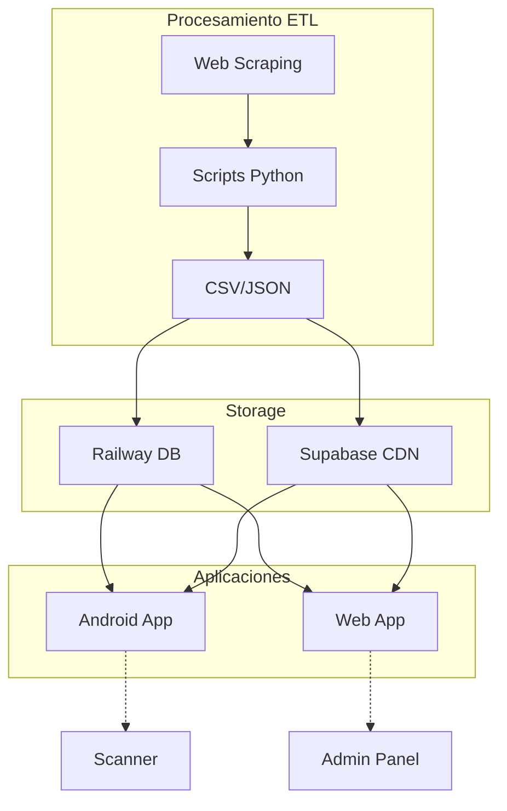

# 🏗️ Arquitectura del Sistema Print & Paint Studio

## 📁 Estructura de Directorios Principal

### **1. Directorio de Procesamiento de Datos**
```
C:\descargar_imagenes\
```
**Propósito**: Procesamiento ETL, web scraping, y gestión de imágenes.

#### **Subdirectorios Críticos**:
```
C:\descargar_imagenes\
├── docs\                                 # Documentación técnica centralizada
├── json imagenes goblintrader\           # Datos extraídos de GoblinTrader
│   ├── ak\                              # AK Interactive
│   │   ├── imagenes\                    # Imágenes descargadas (212 archivos)
│   │   ├── goblin_trader_ak_*.csv      # CSVs procesados
│   │   └── goblin_trader_ak_*.json     # JSONs originales
│   ├── json_scale\                      # Scale75
│   │   ├── imagenes\                    # Directorio de imágenes
│   │   └── scale75_*.json              # JSONs (555 productos)
│   └── vallejo\                         # Vallejo paints
│       └── [estructura similar]
├── conexion_railway_no_tocar\           # Configuraciones críticas
└── *.py                                 # Scripts de procesamiento
```

#### **Scripts Principales**:
- `fix_ak_codes.py` - Limpieza de códigos de productos
- `update_ak_ean_simple.py` - Sincronización EAN con Railway
- `download_ak_images.py` - Descarga masiva con cloudscraper
- `subir_imagenes_ak_supabase.py` - Migración a CDN
- `verificar_inconsistencias_supabase.py` - Validación de integridad

---

### **2. Aplicación Android - PaintScanner**
```
C:\Paintscanner\
```
**Propósito**: Aplicación móvil para escaneo y gestión de pinturas.

#### **Estructura Recomendada**:
```
C:\Paintscanner\
├── docs\                                # Documentación específica Android
│   ├── API_INTEGRATION.md              # Guía de integración con Railway/Supabase
│   ├── CAMERA_SCANNER.md               # Implementación de escaneo
│   └── conexion_supabase.md            # Credenciales y configuración
├── app\
│   ├── src\
│   │   ├── main\
│   │   │   ├── java\                   # Código Kotlin/Java
│   │   │   ├── res\                    # Recursos Android
│   │   │   └── AndroidManifest.xml
│   │   └── test\                       # Tests unitarios
│   └── build.gradle
├── gradle\                              # Configuración Gradle
└── README.md                            # Documentación principal
```

#### **Integraciones Clave**:
```kotlin
// app/src/main/java/config/ApiConfig.kt
object ApiConfig {
    const val RAILWAY_BASE_URL = "https://print-and-paint-studio-app-production.up.railway.app"
    const val RAILWAY_API_KEY = "print_and_paint_secret_key_2025"
    const val SUPABASE_URL = "https://qzjhlktrosfrurwthvkw.supabase.co"
    const val SUPABASE_ANON_KEY = "eyJhbGci..."
}
```

---

### **3. Aplicación Web - Print & Paint Studio**
```
C:\Repositorio GitHub VSC\print-and-paint-studio-app\
```
**Propósito**: Aplicación web full-stack para gestión de inventario.

#### **Estructura del Proyecto**:
```
C:\Repositorio GitHub VSC\print-and-paint-studio-app\
├── docs\                                # Documentación técnica
│   ├── API_SPECIFICATION.md            # Especificación OpenAPI
│   ├── DATABASE_SCHEMA.md              # Esquema PostgreSQL
│   ├── DEPLOYMENT.md                   # Guía de despliegue Railway
│   └── conexion_supabase.md            # Configuración CDN
├── src\
│   ├── components\                      # Componentes React
│   ├── pages\                          # Páginas Next.js
│   ├── api\                            # API Routes
│   │   └── paints\                     # Endpoints de pinturas
│   ├── lib\                            # Utilidades
│   │   ├── db.js                      # Conexión PostgreSQL
│   │   └── supabase.js                # Cliente Supabase
│   └── styles\                         # CSS/Tailwind
├── public\                              # Assets públicos
├── prisma\                              # ORM Schema
│   └── schema.prisma
├── .env.local                          # Variables de entorno
├── package.json
└── next.config.js
```

#### **Configuración de Servicios**:
```javascript
// src/lib/config.js
export const config = {
  database: {
    url: process.env.DATABASE_URL // Railway PostgreSQL
  },
  supabase: {
    url: process.env.NEXT_PUBLIC_SUPABASE_URL,
    anonKey: process.env.NEXT_PUBLIC_SUPABASE_ANON_KEY,
    serviceKey: process.env.SUPABASE_SERVICE_KEY
  },
  api: {
    key: process.env.API_KEY // print_and_paint_secret_key_2025
  }
}
```

---

## 🔄 Flujo de Datos Entre Sistemas



---

## 🗄️ Esquema de Base de Datos (Railway)

### **Tabla: paints**
```sql
CREATE TABLE paints (
    id SERIAL PRIMARY KEY,
    brand VARCHAR(50) NOT NULL,
    color_code VARCHAR(50) NOT NULL,
    name VARCHAR(255) NOT NULL,
    ean VARCHAR(13),
    hex_color VARCHAR(7),
    image_url TEXT,
    created_at TIMESTAMP DEFAULT CURRENT_TIMESTAMP,
    updated_at TIMESTAMP DEFAULT CURRENT_TIMESTAMP,
    UNIQUE(brand, color_code)
);

-- Índices para optimización
CREATE INDEX idx_brand ON paints(brand);
CREATE INDEX idx_color_code ON paints(color_code);
CREATE INDEX idx_ean ON paints(ean);
```

---

## 🔌 Endpoints API Principales

### **1. Obtener Pinturas**
```http
GET /api/paints
Headers: X-API-Key: print_and_paint_secret_key_2025

Query Parameters:
- brand: string (opcional)
- limit: number (default: 100)
- offset: number (default: 0)
```

### **2. Actualizar Pintura**
```http
PUT /api/paints/:id
Headers: 
  X-API-Key: print_and_paint_secret_key_2025
  Content-Type: application/json

Body:
{
  "ean": "string",
  "image_url": "string",
  "hex_color": "string"
}
```

### **3. Crear Pintura**
```http
POST /api/paints
Headers: 
  X-API-Key: print_and_paint_secret_key_2025
  Content-Type: application/json

Body:
{
  "brand": "string",
  "color_code": "string",
  "name": "string",
  "ean": "string",
  "hex_color": "string",
  "image_url": "string"
}
```

---

## 🚀 Guía de Desarrollo Rápido

### **Para Desarrolladores Android**:
1. Clonar repositorio en `C:\Paintscanner`
2. Configurar API keys en `local.properties`
3. Sincronizar Gradle
4. Implementar scanner usando CameraX
5. Integrar con Railway API para búsquedas

### **Para Desarrolladores Web**:
1. Clonar repositorio en `C:\Repositorio GitHub VSC\print-and-paint-studio-app`
2. Instalar dependencias: `npm install`
3. Configurar `.env.local` con credenciales
4. Ejecutar migraciones Prisma: `npx prisma migrate dev`
5. Iniciar desarrollo: `npm run dev`

### **Para Procesamiento de Datos**:
1. Trabajar en `C:\descargar_imagenes`
2. Usar Python 3.8+
3. Instalar dependencias: `pip install -r requirements.txt`
4. Ejecutar scripts en orden según necesidad

---

## 📊 Métricas del Sistema

| Componente | Tecnología | Estado |
|------------|------------|---------|
| Base de Datos | PostgreSQL (Railway) | ✅ Activo |
| CDN Imágenes | Supabase Storage | ✅ Activo |
| API Backend | Next.js API Routes | ✅ Activo |
| App Android | Kotlin + Retrofit | 🔧 Desarrollo |
| App Web | Next.js + React | ✅ Activo |
| ETL Scripts | Python 3.8 | ✅ Activo |

---

**Última actualización**: 27/07/2025
**Versión**: 2.0.0