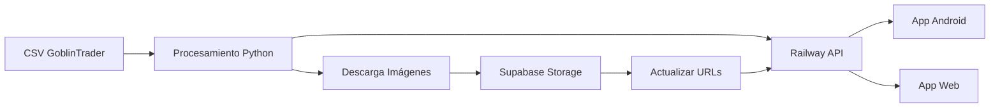

# 📋 CHANGELOG - Sistema de Gestión de Pinturas
## Fecha: 27 de Julio de 2025

### 🔧 Cambios Técnicos Implementados

#### 1. **Procesamiento de Datos CSV - AK Interactive**
- **Archivo procesado**: `goblin_trader_ak_COMPLETE_ALL_PRODUCTS_20250727_154107.csv`
- **Modificación**: Eliminación del sufijo `-6` en códigos de productos
- **Script**: `fix_ak_codes.py`
- **Registros afectados**: 249 productos
- **Regex aplicado**: `df['code'].str.replace('-6', '', regex=True)`

#### 2. **Integración Base de Datos Railway**
- **Endpoint API**: `https://print-and-paint-studio-app-production.up.railway.app/api/paints`
- **Autenticación**: Header `X-API-Key: print_and_paint_secret_key_2025`
- **Actualización EAN**: 249 productos AK actualizados
- **Script**: `update_ak_ean_simple.py`
- **Método HTTP**: PUT requests con JSON payload

#### 3. **Descarga de Imágenes de Productos**
- **Total imágenes descargadas**: 212 archivos
- **Convención de nombres**: `AK_[CODIGO].jpg`
- **Directorio destino**: `/json imagenes goblintrader/ak/imagenes/`
- **Solución 403**: Implementación de cloudscraper
- **Script**: `download_ak_images.py`

#### 4. **Alta de Nuevos Productos**
- **Productos creados**: 9 nuevos registros AK
- **Validación**: Verificación de duplicados por brand='AK' y color_code
- **Script**: `alta_nuevos_productos_ak.py`
- **Formato entrada**: CSV con estructura Salvamento_base_datos

#### 5. **Migración a Supabase Storage**
- **Bucket**: `paint-images`
- **Directorio**: `/AK/`
- **Imágenes migradas**: 212 (817 ya existían)
- **URLs actualizadas**: 827 productos
- **Scripts**:
  - `subir_imagenes_ak_supabase.py`
  - `actualizar_urls_railway.py`
  - `verificar_inconsistencias_supabase.py`

#### 6. **Resolución de Inconsistencias**
- **Inconsistencias detectadas**: 8 URLs sin archivo físico
- **Resueltas**: 5 archivos subidos
- **Pendientes**: 3 archivos (RCS022, AK9528, AK9529)
- **Script**: `subir_archivos_faltantes.py`

---

### 🏗️ Arquitectura del Sistema

#### **Estructura de Directorios**

```
C:\descargar_imagenes\                    # Procesamiento de datos
├── docs\                                 # Documentación técnica
├── json imagenes goblintrader\           # Datos scraped
│   ├── ak\                              # Productos AK Interactive
│   │   ├── imagenes\                    # Imágenes descargadas
│   │   └── *.csv                        # Archivos CSV procesados
│   ├── json_scale\                      # Productos Scale75
│   └── vallejo\                         # Productos Vallejo
└── *.py                                 # Scripts de procesamiento

C:\Paintscanner\                          # Aplicación Android
├── docs\                                # Documentación específica Android
├── app\                                 # Código fuente Android
└── [estructura proyecto Android]

C:\Repositorio GitHub VSC\print-and-paint-studio-app\  # Aplicación Web
├── docs\                                # Documentación específica Web
├── src\                                 # Código fuente Web
└── [estructura proyecto Web]
```

---

### 🔌 APIs y Servicios Externos

#### **1. Railway PostgreSQL (Base de Datos Principal)**
```javascript
const config = {
  baseURL: 'https://print-and-paint-studio-app-production.up.railway.app',
  apiKey: 'print_and_paint_secret_key_2025',
  endpoints: {
    paints: '/api/paints',
    paint: '/api/paints/:id'
  }
}
```

#### **2. Supabase Storage (CDN de Imágenes)**
```javascript
const supabaseConfig = {
  url: 'https://qzjhlktrosfrurwthvkw.supabase.co',
  anonKey: 'eyJhbGci...', // Ver conexion_supabase.md
  serviceKey: 'eyJhbGci...', // Ver conexion_supabase.md
  bucket: 'paint-images',
  publicUrl: 'https://qzjhlktrosfrurwthvkw.supabase.co/storage/v1/object/public/paint-images/'
}
```

---

### 📊 Estadísticas de Procesamiento

| Operación | Cantidad | Estado |
|-----------|----------|---------|
| Códigos AK corregidos | 249 | ✅ Completado |
| EAN actualizados | 249 | ✅ Completado |
| Imágenes descargadas | 212 | ✅ Completado |
| Productos nuevos | 9 | ✅ Completado |
| URLs migradas a Supabase | 827 | ✅ Completado |
| Inconsistencias resueltas | 5/8 | ⚠️ Parcial |

---

### 🚨 Problemas Identificados y Soluciones

#### **1. Error 403 en Descarga de Imágenes**
- **Problema**: Bloqueo por User-Agent
- **Solución**: Implementación de cloudscraper
- **Código**:
```python
import cloudscraper
scraper = cloudscraper.create_scraper()
response = scraper.get(url, timeout=30)
```

#### **2. Campo image_url vs imagen_url**
- **Problema**: Confusión en nombre de campo
- **Solución**: Verificación de estructura API
- **Campo correcto**: `image_url`

#### **3. Protección Anti-Bot Scale75**
- **Problema**: HTTP 202 en todas las peticiones
- **Intento 1**: CloudScraper - Fallido
- **Intento 2**: Headers personalizados - Fallido
- **Intento 3**: Selenium - Requiere navegador
- **Estado**: Pendiente configuración Windows

---

### 🔄 Flujo de Trabajo Implementado



---

### 📝 Scripts Críticos para Mantenimiento

1. **`verificar_inconsistencias_supabase.py`**
   - Ejecutar semanalmente
   - Detecta URLs rotas
   - Identifica archivos huérfanos

2. **`actualizar_urls_railway.py`**
   - Usar después de subir imágenes
   - Sincroniza Railway con Supabase
   - Actualización masiva de URLs

3. **`download_[marca]_images.py`**
   - Scripts específicos por marca
   - Manejo de anti-bot personalizado
   - Convenciones de nombres consistentes

---

### ⚡ Próximos Pasos Recomendados

1. **Completar migración Scale75**
   - Resolver protección anti-bot
   - 555 productos pendientes

2. **Automatización de sincronización**
   - Cron job para verificación
   - Alertas de inconsistencias

3. **Optimización de imágenes**
   - Compresión automática
   - Generación de thumbnails

4. **Documentación de API**
   - OpenAPI/Swagger spec
   - Ejemplos de integración

---

**Generado por**: Sistema de Documentación Automática
**Revisión**: 27/07/2025 17:30 UTC