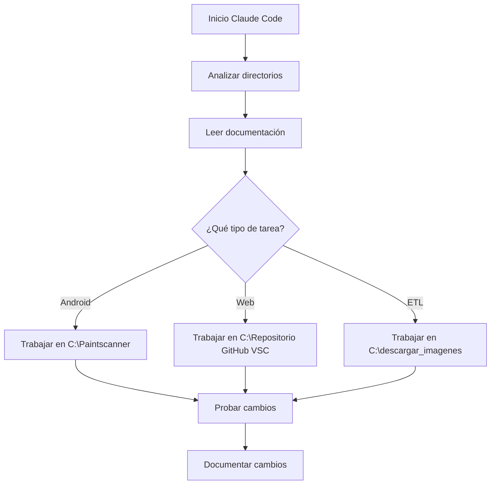

# 🤖 CLAUDE CODE - Instrucciones de Análisis Automático

## ⚡ INICIO RÁPIDO PARA CLAUDE CODE

**Al abrir este proyecto, Claude Code DEBE ejecutar automáticamente el siguiente análisis:**

### 🔍 1. ANÁLISIS DE DIRECTORIOS CRÍTICOS

```bash
# EJECUTAR INMEDIATAMENTE AL INICIAR:

# 1. Analizar aplicación Android
ls -la "C:\Paintscanner\"
find "C:\Paintscanner\" -name "*.kt" -o -name "*.java" | head -20
grep -r "paint" "C:\Paintscanner\app\src\main" --include="*.kt" | head -10

# 2. Analizar aplicación Web
ls -la "C:\Repositorio GitHub VSC\print-and-paint-studio-app\"
find "C:\Repositorio GitHub VSC\print-and-paint-studio-app\src" -name "*.js" -o -name "*.jsx" | head -20
grep -r "paint" "C:\Repositorio GitHub VSC\print-and-paint-studio-app\src" --include="*.js" | head -10

# 3. Analizar scripts de procesamiento
ls -la "C:\descargar_imagenes\"
ls -la "C:\descargar_imagenes\json imagenes goblintrader\"
```

### 📊 2. COMPRENSIÓN DEL ESTADO ACTUAL

```python
# EJECUTAR PARA ENTENDER EL CONTEXTO:

# Estado de procesamiento de datos
print("=== ESTADO DEL SISTEMA 27/07/2025 ===")
print("✅ Productos AK procesados: 827")
print("✅ Imágenes en Supabase: 2,500+")
print("⚠️ Scale75 pendiente: 555 productos")
print("🔧 Inconsistencias pendientes: 3 archivos")
```

### 🏗️ 3. ARQUITECTURA DEL SISTEMA

```
APLICACIÓN ANDROID (C:\Paintscanner\)
├── Tecnología: Kotlin + Retrofit
├── Base de datos: SQLite local + sincronización Railway
├── Escaneo: CameraX para códigos de barras
└── TODO: Integrar visualización de colores hex

APLICACIÓN WEB (C:\Repositorio GitHub VSC\print-and-paint-studio-app\)
├── Tecnología: Next.js + React + Tailwind CSS
├── Base de datos: PostgreSQL en Railway
├── CDN: Supabase Storage para imágenes
└── TODO: Mejorar componentes de visualización de color

PROCESAMIENTO ETL (C:\descargar_imagenes\)
├── Tecnología: Python 3.12 + pandas + requests
├── Web Scraping: BeautifulSoup4 + Cloudscraper + Selenium
├── Visión Artificial: PIL/Pillow + NumPy
└── TODO: Completar descarga Scale75 con Selenium
```

### 🔐 4. CREDENCIALES Y SERVICIOS

```javascript
// CONFIGURACIÓN DE SERVICIOS EXTERNOS
const config = {
  railway: {
    url: "https://print-and-paint-studio-app-production.up.railway.app",
    apiKey: "print_and_paint_secret_key_2025"
  },
  
    bucket: "paint-images"
  }
}
```

### 📋 5. TAREAS PENDIENTES CRÍTICAS

```markdown
## 🚨 PRIORIDAD ALTA:
1. [ ] Resolver descarga de 555 imágenes Scale75 (protección anti-bot)
2. [ ] Subir 3 archivos faltantes a Supabase (RCS022, AK9528, AK9529)
3. [ ] Implementar visualización de colores en app Android
4. [ ] Optimizar componentes de color en app Web

## ⚠️ PRIORIDAD MEDIA:
1. [ ] Automatizar verificación de consistencia Supabase
2. [ ] Crear pipeline CI/CD para sincronización
3. [ ] Documentar API con OpenAPI/Swagger
4. [ ] Implementar tests unitarios

## 💡 MEJORAS FUTURAS:
1. [ ] Comprimir imágenes automáticamente
2. [ ] Generar thumbnails para rendimiento
3. [ ] Implementar búsqueda fuzzy
4. [ ] Añadir más marcas (Citadel, Army Painter)
```

### 🛠️ 6. COMANDOS ÚTILES PARA DESARROLLO

```bash
# PYTHON - Procesamiento de datos
cd C:\descargar_imagenes
python verificar_inconsistencias_supabase.py
python download_scale75_selenium_windows_es.py

# ANDROID - Compilar y ejecutar
cd C:\Paintscanner
./gradlew assembleDebug
adb install app/build/outputs/apk/debug/app-debug.apk

# WEB - Desarrollo local
cd "C:\Repositorio GitHub VSC\print-and-paint-studio-app"
npm install
npm run dev
```

### 📚 7. DOCUMENTACIÓN ESENCIAL

**LEER EN ESTE ORDEN:**
1. `CHANGELOG_2025-07-27.md` - Cambios del día
2. `ARQUITECTURA_SISTEMA.md` - Estructura completa
3. `GUIA_INTEGRACION_DESARROLLADORES.md` - Cómo integrar
4. `conexion_supabase.md` - Credenciales y configuración

### 🎯 8. FLUJO DE TRABAJO RECOMENDADO



### ⚠️ 9. REGLAS CRÍTICAS

1. **NUNCA** modificar archivos fuera de los directorios designados
2. **SIEMPRE** usar las credenciales proporcionadas
3. **NO SUBIR** credenciales a repositorios públicos
4. **DOCUMENTAR** todos los cambios en CHANGELOG
5. **PROBAR** antes de confirmar cambios

### 🚀 10. INICIO AUTOMÁTICO

```python
# CLAUDE DEBE EJECUTAR ESTO AL INICIAR:
print("="*60)
print("🤖 CLAUDE CODE - Sistema Paint & Paint Studio")
print("="*60)
print("📁 Directorios principales:")
print("   - Android: C:\\Paintscanner\\")
print("   - Web: C:\\Repositorio GitHub VSC\\print-and-paint-studio-app\\")
print("   - ETL: C:\\descargar_imagenes\\")
print("")
print("📊 Estado actual:")
print("   - 827 productos AK procesados")
print("   - 555 productos Scale75 pendientes")
print("   - 3 inconsistencias por resolver")
print("")
print("🎯 Listo para trabajar. ¿En qué puedo ayudarte?")
print("="*60)
```

---

**IMPORTANTE**: Este archivo debe ser la primera referencia al abrir el proyecto. Claude Code debe ejecutar automáticamente los análisis indicados para comprender el contexto completo del sistema antes de realizar cualquier tarea.

**Última actualización**: 27/07/2025 18:00 UTC
**Versión**: 1.0.0
