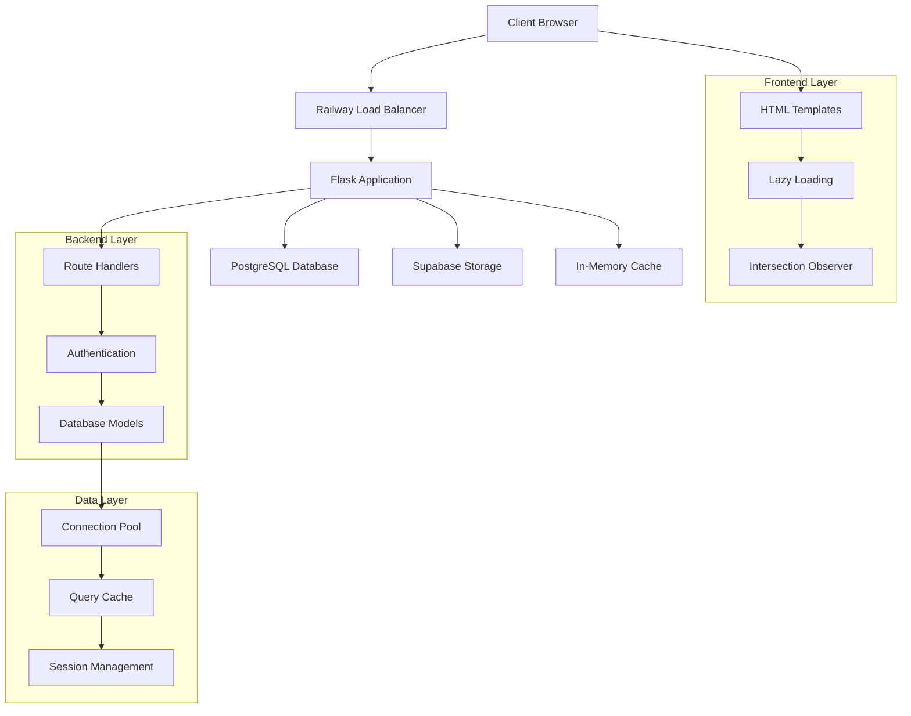

# Architecture and Performance Patterns Guide

## Overview

This document outlines the architectural patterns and performance optimization strategies implemented in the Paint and Print Studio application, focusing on scalability, maintainability, and performance.

## System Architecture

### High-Level Architecture


### Technology Stack
- **Frontend**: Vanilla JavaScript, Bootstrap 5.3, Intersection Observer API
- **Backend**: Flask 2.x, SQLAlchemy ORM, Python 3.9+
- **Database**: PostgreSQL 13+ (Railway)
- **Storage**: Supabase for image assets
- **Deployment**: Railway platform
- **Monitoring**: Custom logging and performance tracking

## Design Patterns

### 1. Lazy Loading Pattern

#### Intent
Load resources on-demand to reduce initial page load time and network congestion.

#### Implementation
```javascript
class LazyImageLoader {
    constructor(options = {}) {
        this.options = {
            rootMargin: '100px',
            threshold: 0.1,
            ...options
        };
        this.observer = this.createObserver();
        this.loadedImages = new Set();
    }
    
    createObserver() {
        return new IntersectionObserver((entries) => {
            entries.forEach(entry => {
                if (entry.isIntersecting) {
                    this.loadImage(entry.target);
                }
            });
        }, this.options);
    }
    
    loadImage(img) {
        const src = img.getAttribute('data-src');
        if (src && !this.loadedImages.has(img)) {
            img.src = src;
            img.removeAttribute('data-src');
            this.loadedImages.add(img);
            this.observer.unobserve(img);
        }
    }
    
    observe(images) {
        images.forEach(img => this.observer.observe(img));
    }
}

// Usage
const lazyLoader = new LazyImageLoader();
const lazyImages = document.querySelectorAll('.lazy-load');
lazyLoader.observe(lazyImages);
```

#### Benefits
- Reduced initial bandwidth usage
- Improved page load performance
- Better user experience on slow connections
- Reduced server load

### 2. Connection Pool Pattern

#### Intent
Manage database connections efficiently to handle concurrent requests without exhausting resources.

#### Implementation
```python
class DatabaseConnectionManager:
    def __init__(self, app):
        self.app = app
        self.configure_pool()
        
    def configure_pool(self):
        """Configure optimized connection pool"""
        self.app.config['SQLALCHEMY_ENGINE_OPTIONS'] = {
            'pool_size': 5,           # Base connections
            'pool_timeout': 20,       # Wait time for connection
            'pool_recycle': 300,      # Connection lifetime
            'max_overflow': 10,       # Additional connections
            'pool_pre_ping': True,    # Health check connections
        }
        
    def get_connection_stats(self):
        """Get current pool statistics"""
        engine = db.engine
        pool = engine.pool
        
        return {
            'size': pool.size(),
            'checked_in': pool.checkedin(),
            'checked_out': pool.checkedout(),
            'overflow': pool.overflow(),
            'invalid': pool.invalid()
        }

# Decorator for proper session management
def with_database_session(f):
    @wraps(f)
    def decorated_function(*args, **kwargs):
        try:
            result = f(*args, **kwargs)
            db.session.commit()
            return result
        except Exception as e:
            db.session.rollback()
            raise
        finally:
            db.session.close()
    return decorated_function
```

#### Benefits
- Prevents connection exhaustion
- Improves response times
- Better resource utilization
- Automatic connection health management

### 3. Caching Decorator Pattern

#### Intent
Provide transparent caching for expensive operations without modifying core business logic.

#### Implementation
```python
import time
from functools import wraps

class CacheManager:
    def __init__(self):
        self.cache = {}
        self.access_times = {}
    
    def cache_result(self, timeout=300, key_func=None):
        """Decorator for caching function results"""
        def decorator(f):
            @wraps(f)
            def decorated_function(*args, **kwargs):
                # Generate cache key
                if key_func:
                    cache_key = key_func(*args, **kwargs)
                else:
                    cache_key = f"{f.__name__}_{hash(str(args))}"
                
                current_time = time.time()
                
                # Check cache
                if cache_key in self.cache:
                    cached_data, cached_time = self.cache[cache_key]
                    if current_time - cached_time < timeout:
                        self.access_times[cache_key] = current_time
                        print(f"📦 Cache HIT for {cache_key}")
                        return cached_data
                
                # Execute function and cache result
                result = f(*args, **kwargs)
                self.cache[cache_key] = (result, current_time)
                self.access_times[cache_key] = current_time
                print(f"💾 Cache MISS for {cache_key}")
                
                return result
            return decorated_function
        return decorator
    
    def invalidate(self, pattern=None):
        """Invalidate cache entries"""
        if pattern:
            keys_to_remove = [k for k in self.cache.keys() if pattern in k]
            for key in keys_to_remove:
                del self.cache[key]
                del self.access_times[key]
        else:
            self.cache.clear()
            self.access_times.clear()
    
    def get_stats(self):
        """Get cache statistics"""
        total_entries = len(self.cache)
        total_size = sum(len(str(data)) for data, _ in self.cache.values())
        
        return {
            'entries': total_entries,
            'estimated_size': total_size,
            'hit_rate': getattr(self, '_hit_rate', 0)
        }

# Global cache manager
cache_manager = CacheManager()

# Usage
@cache_manager.cache_result(timeout=300)
def get_paint_data(paint_id):
    """Cached paint retrieval"""
    return db.session.query(Paint).filter_by(id=paint_id).first()
```

#### Benefits
- Transparent caching integration
- Configurable cache policies
- Automatic cache invalidation
- Performance monitoring capabilities

### 4. Smart Polling Pattern

#### Intent
Implement intelligent auto-refresh that adapts to user activity to minimize unnecessary requests.

#### Implementation
```javascript
class SmartPoller {
    constructor(options = {}) {
        this.options = {
            interval: 60000,          // Base interval (60s)
            inactivityThreshold: 30000, // 30s inactivity
            maxInterval: 300000,      // Max interval (5 minutes)
            backoffMultiplier: 1.5,   // Exponential backoff
            ...options
        };
        
        this.lastActivity = Date.now();
        this.currentInterval = this.options.interval;
        this.isPolling = false;
        this.pollTimer = null;
        
        this.setupActivityDetection();
    }
    
    setupActivityDetection() {
        const events = ['click', 'keydown', 'mousemove', 'scroll'];
        events.forEach(event => {
            document.addEventListener(event, () => {
                this.lastActivity = Date.now();
                this.resetInterval();
            }, { passive: true });
        });
    }
    
    resetInterval() {
        this.currentInterval = this.options.interval;
    }
    
    increaseInterval() {
        this.currentInterval = Math.min(
            this.currentInterval * this.options.backoffMultiplier,
            this.options.maxInterval
        );
    }
    
    shouldPoll() {
        const timeSinceActivity = Date.now() - this.lastActivity;
        return timeSinceActivity > this.options.inactivityThreshold;
    }
    
    async poll(callback) {
        if (!this.shouldPoll()) {
            console.log('⏸️ Skipping poll - user is active');
            return;
        }
        
        try {
            console.log(`🔄 Polling with interval: ${this.currentInterval}ms`);
            await callback();
            this.resetInterval(); // Reset on success
        } catch (error) {
            console.error('❌ Poll failed:', error);
            this.increaseInterval(); // Backoff on failure
        }
    }
    
    start(callback) {
        if (this.isPolling) return;
        
        this.isPolling = true;
        const doPoll = async () => {
            if (!this.isPolling) return;
            
            await this.poll(callback);
            this.pollTimer = setTimeout(doPoll, this.currentInterval);
        };
        
        doPoll();
    }
    
    stop() {
        this.isPolling = false;
        if (this.pollTimer) {
            clearTimeout(this.pollTimer);
            this.pollTimer = null;
        }
    }
}

// Usage
const poller = new SmartPoller({
    interval: 60000,
    inactivityThreshold: 30000
});

poller.start(async () => {
    await silentRefresh();
});
```

#### Benefits
- Adaptive polling based on user activity
- Exponential backoff on failures
- Reduced server load during inactivity
- Improved user experience

### 5. Error Recovery Pattern

#### Intent
Implement robust error handling with automatic retry and graceful degradation.

#### Implementation
```python
import time
import random
from functools import wraps

class ErrorRecoveryManager:
    def __init__(self):
        self.retry_counts = {}
        self.circuit_breakers = {}
    
    def with_retry(self, max_retries=3, backoff_base=1, exceptions=(Exception,)):
        """Decorator for automatic retry with exponential backoff"""
        def decorator(f):
            @wraps(f)
            def decorated_function(*args, **kwargs):
                func_key = f"{f.__name__}_{id(f)}"
                
                for attempt in range(max_retries + 1):
                    try:
                        result = f(*args, **kwargs)
                        # Reset retry count on success
                        self.retry_counts.pop(func_key, None)
                        return result
                        
                    except exceptions as e:
                        if attempt == max_retries:
                            raise
                        
                        # Calculate backoff time
                        backoff_time = backoff_base * (2 ** attempt) + random.uniform(0, 1)
                        print(f"🔄 Retry {attempt + 1}/{max_retries} for {f.__name__} in {backoff_time:.2f}s")
                        
                        time.sleep(backoff_time)
                        self.retry_counts[func_key] = attempt + 1
                
            return decorated_function
        return decorator
    
    def circuit_breaker(self, failure_threshold=5, recovery_timeout=60):
        """Circuit breaker pattern implementation"""
        def decorator(f):
            @wraps(f)
            def decorated_function(*args, **kwargs):
                func_key = f"{f.__name__}_{id(f)}"
                
                if func_key not in self.circuit_breakers:
                    self.circuit_breakers[func_key] = {
                        'failures': 0,
                        'last_failure': 0,
                        'state': 'CLOSED'  # CLOSED, OPEN, HALF_OPEN
                    }
                
                breaker = self.circuit_breakers[func_key]
                current_time = time.time()
                
                # Check if circuit is open
                if breaker['state'] == 'OPEN':
                    if current_time - breaker['last_failure'] > recovery_timeout:
                        breaker['state'] = 'HALF_OPEN'
                        print(f"🔄 Circuit breaker HALF_OPEN for {f.__name__}")
                    else:
                        raise Exception(f"Circuit breaker OPEN for {f.__name__}")
                
                try:
                    result = f(*args, **kwargs)
                    
                    # Reset on success
                    if breaker['state'] == 'HALF_OPEN':
                        breaker['state'] = 'CLOSED'
                        breaker['failures'] = 0
                        print(f"✅ Circuit breaker CLOSED for {f.__name__}")
                    
                    return result
                    
                except Exception as e:
                    breaker['failures'] += 1
                    breaker['last_failure'] = current_time
                    
                    if breaker['failures'] >= failure_threshold:
                        breaker['state'] = 'OPEN'
                        print(f"⚡ Circuit breaker OPEN for {f.__name__}")
                    
                    raise
                    
            return decorated_function
        return decorator

# Global error recovery manager
error_recovery = ErrorRecoveryManager()

# Usage examples
@error_recovery.with_retry(max_retries=3, exceptions=(ConnectionError, TimeoutError))
@error_recovery.circuit_breaker(failure_threshold=5)
def database_operation():
    """Database operation with retry and circuit breaker"""
    return db.session.query(Paint).all()
```

#### Benefits
- Automatic error recovery
- Prevents cascade failures
- Improved system resilience
- Graceful degradation

## Performance Patterns

### 1. Resource Pooling

#### Database Connection Pooling
```python
# Optimized pool configuration
POOL_SETTINGS = {
    'pool_size': 5,           # Base connections
    'max_overflow': 10,       # Burst capacity
    'pool_timeout': 20,       # Connection wait time
    'pool_recycle': 300,      # Connection lifetime
    'pool_pre_ping': True,    # Health checks
}
```

#### Benefits
- Efficient resource utilization
- Predictable performance
- Reduced connection overhead
- Better scalability

### 2. Lazy Initialization

#### Component Lazy Loading
```javascript
class ComponentManager {
    constructor() {
        this.components = new Map();
        this.initializers = new Map();
    }
    
    register(name, initializer) {
        this.initializers.set(name, initializer);
    }
    
    get(name) {
        if (!this.components.has(name)) {
            const initializer = this.initializers.get(name);
            if (initializer) {
                this.components.set(name, initializer());
            }
        }
        return this.components.get(name);
    }
}

// Usage
const componentManager = new ComponentManager();

componentManager.register('lazyLoader', () => {
    return new LazyImageLoader();
});

// Component only initialized when first accessed
const loader = componentManager.get('lazyLoader');
```

### 3. Batching Pattern

#### Request Batching
```javascript
class RequestBatcher {
    constructor(batchSize = 10, delay = 100) {
        this.batchSize = batchSize;
        this.delay = delay;
        this.queue = [];
        this.timer = null;
    }
    
    add(request) {
        return new Promise((resolve, reject) => {
            this.queue.push({ request, resolve, reject });
            
            if (this.queue.length >= this.batchSize) {
                this.flush();
            } else if (!this.timer) {
                this.timer = setTimeout(() => this.flush(), this.delay);
            }
        });
    }
    
    async flush() {
        if (this.timer) {
            clearTimeout(this.timer);
            this.timer = null;
        }
        
        if (this.queue.length === 0) return;
        
        const batch = this.queue.splice(0);
        
        try {
            const requests = batch.map(item => item.request);
            const results = await this.processBatch(requests);
            
            batch.forEach((item, index) => {
                item.resolve(results[index]);
            });
        } catch (error) {
            batch.forEach(item => {
                item.reject(error);
            });
        }
    }
    
    async processBatch(requests) {
        // Process multiple requests together
        const response = await fetch('/api/batch', {
            method: 'POST',
            headers: { 'Content-Type': 'application/json' },
            body: JSON.stringify({ requests })
        });
        return response.json();
    }
}
```

## Anti-Patterns to Avoid

### 1. N+1 Query Problem
```python
# Bad: N+1 queries
def get_paints_with_details():
    paints = Paint.query.all()  # 1 query
    for paint in paints:
        paint.brand_details = Brand.query.get(paint.brand_id)  # N queries
    return paints

# Good: Eager loading
def get_paints_with_details():
    return Paint.query.options(joinedload(Paint.brand)).all()  # 1 query
```

### 2. Memory Leaks in Event Listeners
```javascript
// Bad: Memory leak
function setupImageLoading() {
    const images = document.querySelectorAll('img');
    images.forEach(img => {
        img.addEventListener('load', handleImageLoad);  // Never removed
    });
}

// Good: Proper cleanup
class ImageManager {
    constructor() {
        this.handlers = new Map();
    }
    
    setupImage(img) {
        const handler = () => this.handleImageLoad(img);
        this.handlers.set(img, handler);
        img.addEventListener('load', handler);
    }
    
    cleanup(img) {
        const handler = this.handlers.get(img);
        if (handler) {
            img.removeEventListener('load', handler);
            this.handlers.delete(img);
        }
    }
}
```

### 3. Blocking Operations
```javascript
// Bad: Blocking main thread
function processLargeDataset(data) {
    // Synchronous processing blocks UI
    return data.map(item => expensiveOperation(item));
}

// Good: Non-blocking with batching
async function processLargeDataset(data) {
    const batchSize = 100;
    const results = [];
    
    for (let i = 0; i < data.length; i += batchSize) {
        const batch = data.slice(i, i + batchSize);
        const batchResults = batch.map(item => expensiveOperation(item));
        results.push(...batchResults);
        
        // Yield control back to browser
        await new Promise(resolve => setTimeout(resolve, 0));
    }
    
    return results;
}
```

## Monitoring and Observability

### Performance Metrics Collection
```javascript
class PerformanceMonitor {
    constructor() {
        this.metrics = new Map();
        this.observers = [];
    }
    
    measure(name, fn) {
        const start = performance.now();
        
        try {
            const result = fn();
            
            if (result instanceof Promise) {
                return result.finally(() => {
                    this.recordMetric(name, performance.now() - start);
                });
            } else {
                this.recordMetric(name, performance.now() - start);
                return result;
            }
        } catch (error) {
            this.recordMetric(name, performance.now() - start, error);
            throw error;
        }
    }
    
    recordMetric(name, duration, error = null) {
        if (!this.metrics.has(name)) {
            this.metrics.set(name, {
                count: 0,
                totalTime: 0,
                errors: 0,
                minTime: Infinity,
                maxTime: 0
            });
        }
        
        const metric = this.metrics.get(name);
        metric.count++;
        metric.totalTime += duration;
        metric.minTime = Math.min(metric.minTime, duration);
        metric.maxTime = Math.max(metric.maxTime, duration);
        
        if (error) {
            metric.errors++;
        }
        
        // Notify observers
        this.observers.forEach(observer => {
            observer({ name, duration, error, metric });
        });
    }
    
    getMetrics() {
        const result = {};
        
        for (const [name, metric] of this.metrics) {
            result[name] = {
                ...metric,
                avgTime: metric.totalTime / metric.count,
                errorRate: metric.errors / metric.count
            };
        }
        
        return result;
    }
}

// Global performance monitor
const perfMonitor = new PerformanceMonitor();

// Usage
const result = perfMonitor.measure('database_query', () => {
    return db.session.query(Paint).all();
});
```

## Deployment Patterns

### Environment Configuration
```python
class Config:
    """Base configuration"""
    SECRET_KEY = os.environ.get('SECRET_KEY')
    SQLALCHEMY_TRACK_MODIFICATIONS = False
    
class DevelopmentConfig(Config):
    """Development configuration"""
    DEBUG = True
    SQLALCHEMY_DATABASE_URI = 'postgresql://localhost/paint_studio_dev'
    SQLALCHEMY_ENGINE_OPTIONS = {
        'pool_size': 3,
        'pool_timeout': 30,
        'pool_recycle': 3600,
        'max_overflow': 5,
    }

class ProductionConfig(Config):
    """Production configuration"""
    DEBUG = False
    SQLALCHEMY_DATABASE_URI = os.environ.get('DATABASE_URL')
    SQLALCHEMY_ENGINE_OPTIONS = {
        'pool_size': 5,
        'pool_timeout': 20,
        'pool_recycle': 300,
        'max_overflow': 10,
        'pool_pre_ping': True,
    }

# Configuration selection
config = {
    'development': DevelopmentConfig,
    'production': ProductionConfig,
    'default': DevelopmentConfig
}
```

## Future Architecture Considerations

### Microservices Evolution
```python
# Current monolithic structure
# /admin/paints -> Single Flask app

# Future microservices structure
# /api/paint-service -> Paint management service
# /api/user-service -> User management service
# /api/image-service -> Image processing service
# /api/notification-service -> Real-time updates
```

### Horizontal Scaling Patterns
```yaml
# Docker Compose for scaling
version: '3.8'
services:
  app:
    build: .
    replicas: 3
    environment:
      - DATABASE_URL=${DATABASE_URL}
      - REDIS_URL=${REDIS_URL}
    depends_on:
      - db
      - redis
      
  nginx:
    image: nginx:alpine
    ports:
      - "80:80"
    depends_on:
      - app
```

### Event-Driven Architecture
```python
# Future event-driven pattern
class EventBus:
    def __init__(self):
        self.subscribers = defaultdict(list)
    
    def publish(self, event_type, data):
        for handler in self.subscribers[event_type]:
            handler(data)
    
    def subscribe(self, event_type, handler):
        self.subscribers[event_type].append(handler)

# Usage
event_bus = EventBus()

@event_bus.subscribe('paint.created')
def invalidate_cache(paint_data):
    cache_manager.invalidate(f"paint_{paint_data['id']}")

@event_bus.subscribe('paint.updated')
def notify_users(paint_data):
    # Send real-time notifications
    pass
```

This architecture guide provides a comprehensive foundation for understanding and extending the Paint and Print Studio application while maintaining high performance and scalability.