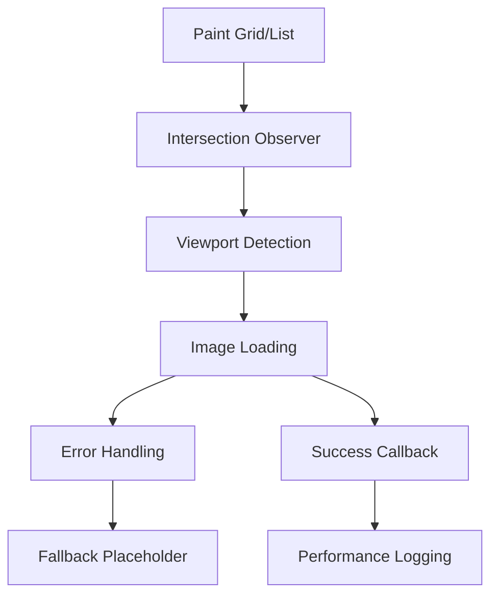

# Lazy Loading Implementation Guide

## Overview

Comprehensive documentation for the Intersection Observer-based lazy loading system implemented to handle 3,000+ images efficiently in the Paint Management module.

## Architecture

### Core Components



### Technical Stack
- **Observer API**: Intersection Observer Web API
- **Placeholder Strategy**: Base64-encoded SVG data URIs
- **Loading Strategy**: Progressive on-demand
- **Error Handling**: Graceful degradation with fallbacks

## Implementation Details

### 1. HTML Structure

#### Grid View Images
```html

```

#### List View Images
```html

```

### 2. Intersection Observer Setup

#### Core Observer Implementation
```javascript
function initializeLazyLoading() {
    const imageObserver = new IntersectionObserver((entries, observer) => {
        entries.forEach(entry => {
            if (entry.isIntersecting) {
                const img = entry.target;
                const realSrc = img.getAttribute('data-src');
                
                if (realSrc) {
                    console.log(`🖼️ Loading lazy image: ${realSrc.substring(0, 50)}...`);
                    
                    // Load real image
                    img.src = realSrc;
                    img.removeAttribute('data-src');
                    
                    // Error handling
                    img.onerror = () => {
                        console.log(`❌ Error loading image: ${realSrc}`);
                        img.src = "data:image/svg+xml;base64,PHN2ZyB3aWR0aD0iMjQwIiBoZWlnaHQ9IjE2MCIgeG1sbnM9Imh0dHA6Ly93d3cudzMub3JnLzIwMDAvc3ZnIj48cmVjdCB3aWR0aD0iMTAwJSIgaGVpZ2h0PSIxMDAlIiBmaWxsPSIjZjBmMGYwIi8+PHRleHQgeD0iNTAlIiB5PSI1MCUiIGZvbnQtZmFtaWx5PSJBcmlhbCwgc2Fucy1zZXJpZiIgZm9udC1zaXplPSIxNCIgZmlsbD0iIzk5OSIgdGV4dC1hbmNob3I9Im1pZGRsZSIgZHk9Ii4zZW0iPkltYWdlbiBubyBkaXNwb25pYmxlPC90ZXh0Pjwvc3ZnPg==";
                    };
                    
                    // Success callback
                    img.onload = () => {
                        console.log(`✅ Image loaded: ${realSrc.substring(0, 50)}...`);
                    };
                    
                    // Stop observing this image
                    observer.unobserve(img);
                }
            }
        });
    }, {
        rootMargin: '100px', // Load images 100px before visible
        threshold: 0.1       // Trigger when 10% visible
    });
    
    // Observe all lazy images
    const lazyImages = document.querySelectorAll('img.lazy-load');
    lazyImages.forEach(img => imageObserver.observe(img));
    
    console.log(`🖼️ Lazy loading initialized for ${lazyImages.length} images`);
}
```

### 3. Integration Points

#### Grid View Integration
```javascript
function displayPaintsAsGrid(paints, container) {
    paints.forEach(paint => {
        // ... paint card creation ...
        container.appendChild(paintCard);
    });
    
    // Initialize lazy loading after rendering
    setTimeout(() => initializeLazyLoading(), 100);
}
```

#### List View Integration
```javascript
function displayPaintsAsList(paints, container) {
    // ... table creation ...
    container.appendChild(table);
    
    // Initialize lazy loading after rendering
    setTimeout(() => initializeLazyLoading(), 100);
}
```

## Configuration Parameters

### Observer Configuration
```javascript
const observerConfig = {
    // Distance from viewport to start loading
    rootMargin: '100px',
    
    // Percentage of element that must be visible
    threshold: 0.1,
    
    // Root element (null = viewport)
    root: null
};
```

### Placeholder Configuration
```javascript
// Grid view placeholder (240x160)
const gridPlaceholder = "data:image/svg+xml;base64,PHN2ZyB3aWR0aD0iMjQwIiBoZWlnaHQ9IjE2MCIgeG1sbnM9Imh0dHA6Ly93d3cudzMub3JnLzIwMDAvc3ZnIj48cmVjdCB3aWR0aD0iMTAwJSIgaGVpZ2h0PSIxMDAlIiBmaWxsPSIjZWVlIi8+PHRleHQgeD0iNTAlIiB5PSI1MCUiIGZvbnQtZmFtaWx5PSJBcmlhbCwgc2Fucy1zZXJpZiIgZm9udC1zaXplPSIxNCIgZmlsbD0iIzk5OSIgdGV4dC1hbmNob3I9Im1pZGRsZSIgZHk9Ii4zZW0iPkNhcmdhbmRvLi4uPC90ZXh0Pjwvc3ZnPg==";

// List view placeholder (50x50)
const listPlaceholder = "data:image/svg+xml;base64,PHN2ZyB3aWR0aD0iNTAiIGhlaWdodD0iNTAiIHhtbG5zPSJodHRwOi8vd3d3LnczLm9yZy8yMDAwL3N2ZyI+PHJlY3Qgd2lkdGg9IjEwMCUiIGhlaWdodD0iMTAwJSIgZmlsbD0iI2VlZSIvPjx0ZXh0IHg9IjUwJSIgeT0iNTAlIiBmb250LWZhbWlseT0iQXJpYWwsIHNhbnMtc2VyaWYiIGZvbnQtc2l6ZT0iOCIgZmlsbD0iIzk5OSIgdGV4dC1hbmNob3I9Im1pZGRsZSIgZHk9Ii4zZW0iPi4uLjwvdGV4dD48L3N2Zz4=";

// Error fallback placeholder
const errorPlaceholder = "data:image/svg+xml;base64,PHN2ZyB3aWR0aD0iMjQwIiBoZWlnaHQ9IjE2MCIgeG1sbnM9Imh0dHA6Ly93d3cudzMub3JnLzIwMDAvc3ZnIj48cmVjdCB3aWR0aD0iMTAwJSIgaGVpZ2h0PSIxMDAlIiBmaWxsPSIjZjBmMGYwIi8+PHRleHQgeD0iNTAlIiB5PSI1MCUiIGZvbnQtZmFtaWx5PSJBcmlhbCwgc2Fucy1zZXJpZiIgZm9udC1zaXplPSIxNCIgZmlsbD0iIzk5OSIgdGV4dC1hbmNob3I9Im1pZGRsZSIgZHk9Ii4zZW0iPkltYWdlbiBubyBkaXNwb25pYmxlPC90ZXh0Pjwvc3ZnPg==";
```

## Performance Optimization

### Image URL Handling
```javascript
// Direct URL usage from database
const imageUrl = paint.image_url || paint.url_de_la_imagen || defaultPlaceholder;

// Debug logging (5% sampling)
if (Math.random() < 0.05) {
    console.log(`🔍 [GRID] Image for paint ${paint.id}:`, {
        image_url: paint.image_url,
        url_de_la_imagen: paint.url_de_la_imagen,
        imageUrl_final: imageUrl
    });
}
```

### Memory Management
```javascript
// Cleanup observer when done
observer.unobserve(img);

// Remove data attributes after loading
img.removeAttribute('data-src');
```

## Browser Compatibility

### Support Matrix
| Browser | Version | Support | Notes |
|---------|---------|---------|-------|
| Chrome | 51+ | ✅ Full | Native support |
| Firefox | 55+ | ✅ Full | Native support |
| Safari | 12.1+ | ✅ Full | Native support |
| Edge | 15+ | ✅ Full | Native support |
| IE | 11 | ❌ None | Polyfill required |

### Polyfill Implementation
```javascript
// Polyfill for older browsers
if (!('IntersectionObserver' in window)) {
    // Load polyfill
    import('intersection-observer').then(() => {
        initializeLazyLoading();
    });
} else {
    initializeLazyLoading();
}
```

## Performance Metrics

### Loading Performance
```javascript
// Track loading times
const loadStart = performance.now();
img.onload = () => {
    const loadTime = performance.now() - loadStart;
    console.log(`⚡ Image loaded in ${loadTime.toFixed(2)}ms`);
};
```

### Observer Performance
```javascript
// Monitor observer efficiency
let observedImages = 0;
let loadedImages = 0;

const imageObserver = new IntersectionObserver((entries) => {
    entries.forEach(entry => {
        if (entry.isIntersecting) {
            observedImages++;
            // ... loading logic ...
            loadedImages++;
            
            // Log efficiency
            const efficiency = (loadedImages / observedImages * 100).toFixed(1);
            console.log(`📊 Lazy loading efficiency: ${efficiency}%`);
        }
    });
});
```

## Error Handling

### Network Errors
```javascript
img.onerror = (event) => {
    console.error(`❌ Failed to load image: ${realSrc}`, event);
    
    // Set fallback image
    img.src = errorPlaceholder;
    
    // Track failed loads
    trackImageError(realSrc, 'network_error');
};
```

### Invalid URLs
```javascript
// Validate URL before loading
function isValidImageUrl(url) {
    try {
        new URL(url);
        return /\.(jpg|jpeg|png|gif|webp|svg)$/i.test(url);
    } catch {
        return false;
    }
}

if (realSrc && isValidImageUrl(realSrc)) {
    img.src = realSrc;
} else {
    console.warn(`⚠️ Invalid image URL: ${realSrc}`);
    img.src = errorPlaceholder;
}
```

## Testing

### Unit Tests
```javascript
describe('Lazy Loading', () => {
    test('should initialize observer', () => {
        const mockObserver = jest.fn();
        global.IntersectionObserver = jest.fn(() => mockObserver);
        
        initializeLazyLoading();
        
        expect(global.IntersectionObserver).toHaveBeenCalled();
    });
    
    test('should load image when intersecting', () => {
        const img = document.createElement('img');
        img.classList.add('lazy-load');
        img.setAttribute('data-src', 'test.jpg');
        
        // Simulate intersection
        const entry = { isIntersecting: true, target: img };
        
        // Should update src
        expect(img.src).toBe('test.jpg');
        expect(img.hasAttribute('data-src')).toBe(false);
    });
});
```

### Performance Tests
```javascript
// Measure initial load time
const initStart = performance.now();
initializeLazyLoading();
const initTime = performance.now() - initStart;
console.log(`🚀 Lazy loading initialized in ${initTime.toFixed(2)}ms`);

// Measure image load distribution
const loadTimes = [];
img.onload = () => {
    const loadTime = performance.now() - loadStart;
    loadTimes.push(loadTime);
    
    if (loadTimes.length >= 10) {
        const avgLoadTime = loadTimes.reduce((a, b) => a + b) / loadTimes.length;
        console.log(`📊 Average load time: ${avgLoadTime.toFixed(2)}ms`);
    }
};
```

## Debugging

### Debug Mode
```javascript
const LAZY_LOADING_DEBUG = true;

function debugLog(message, data = null) {
    if (LAZY_LOADING_DEBUG) {
        console.log(`🔍 [LAZY-LOADING] ${message}`, data || '');
    }
}

// Usage
debugLog('Observer initialized', { imageCount: lazyImages.length });
debugLog('Image loading started', { src: realSrc });
debugLog('Image loaded successfully', { loadTime: `${loadTime}ms` });
```

### Performance Monitoring
```javascript
// Monitor viewport changes
const viewportObserver = new IntersectionObserver((entries) => {
    entries.forEach(entry => {
        if (entry.isIntersecting) {
            console.log(`📍 Image entering viewport:`, entry.target.alt);
        } else {
            console.log(`📍 Image leaving viewport:`, entry.target.alt);
        }
    });
});
```

## Migration Guide

### From Immediate Loading
```javascript
// Before: Immediate loading


// After: Lazy loading

```

### Update Rendering Functions
```javascript
// Add initialization call
function displayPaints(paints) {
    // ... rendering logic ...
    
    // Add this line
    setTimeout(() => initializeLazyLoading(), 100);
}
```

## Best Practices

### Implementation Guidelines
1. **Always use placeholders** to prevent layout shift
2. **Set appropriate rootMargin** based on scroll speed
3. **Clean up observers** to prevent memory leaks
4. **Implement error handling** for failed loads
5. **Use performance logging** for monitoring

### Performance Tips
1. **Optimize placeholder size** to match final image dimensions
2. **Use appropriate threshold values** for smooth loading
3. **Implement retry logic** for failed loads
4. **Monitor memory usage** in long sessions
5. **Consider preloading** for critical images

### Common Pitfalls
1. **Layout shift** from missing placeholders
2. **Memory leaks** from unobserved images
3. **Excessive logging** in production
4. **Missing error handling** for network failures
5. **Incorrect threshold values** causing poor UX

## Future Enhancements

### Planned Features
1. **Priority loading** for above-the-fold images
2. **Adaptive quality** based on network conditions
3. **Preload next batch** for infinite scroll
4. **WebP format detection** for modern browsers
5. **Service worker caching** for offline support

### Performance Improvements
1. **Virtual scrolling** for large datasets
2. **Image compression** at different breakpoints
3. **Progressive JPEG** support
4. **Connection-aware loading** (slow/fast networks)
5. **Battery-aware loading** on mobile devices